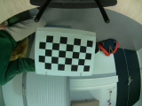
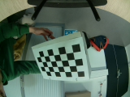

# Camera Calibration

### Installation and set-up

This part can be done on the host pc. See Usage for the rapsberry pi integration.

#### Install library



```
//Conda install
conda install -c conda-forge opencv
```



```
//pip install
pip install opencv-python
```



#### Print checkerboard

The calibration method use image detection for distortion parameters identification. This method is based on 3D line distortion on the checkerboard.

Download and print a checkerboard on the website : [https://markhedleyjones.com/projects/calibration-checkerboard-collection](https://markhedleyjones.com/projects/calibration-checkerboard-collection)

Don't forget to write down the verticies dimension as it is an input of the python script. For example we have tested the "[A4 - 35mm squares - 7x4 verticies, 8x5 squares](https://raw.githubusercontent.com/MarkHedleyJones/markhedleyjones.github.io/master/media/calibration-checkerboard-collection/Checkerboard-A4-35mm-7x4.pdf)"

#### Create a set of images

Lens calibration uses a set of images taken by the same camera/lens, each one showing a checkerboard pattern in a different position, so that taken collectively, the checkerboard appears in almost entire field of view. The more images, the more accurate the calibration will be, but typically 10 to 15 images suffice.




It is possible to use the script _take\_picture\_rasp.py_ to create the set of images.

#### Calibrate the camera lens

Now it is time to use the script _calibrate\_cam.py._&#x20;

Take the images set and put it in the same directory as _calibrate\_cam.py._ In this script input the checkerboard vertices on line 8 : CHECKERBOARD = (4,7).&#x20;

```
// Example of the output

Found 6 valid images for calibration
DIM=(160, 120)
K=np.array([[76.40210369377033, 0.0, 85.17741324657462], [0.0, 75.55575570884872, 61.5111216120113], [0.0, 0.0, 1.0]])
D=np.array([[0.032858036745614], [-0.09739958496116238], [0.07344214252074698], [-0.02977154953395648]])

Process finished with exit code 0

```

Save the 3 output (DIM, K and D).

### Usage

To unfish the images, you can use the example _undistort.py._ Replace (DIM,K and D) with the output of the calibration and it is done.

...
