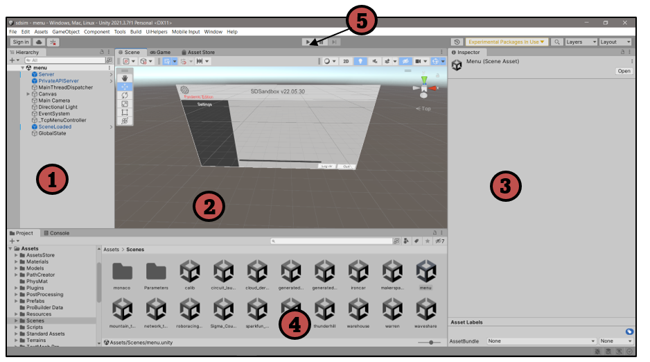
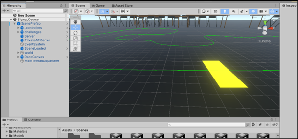
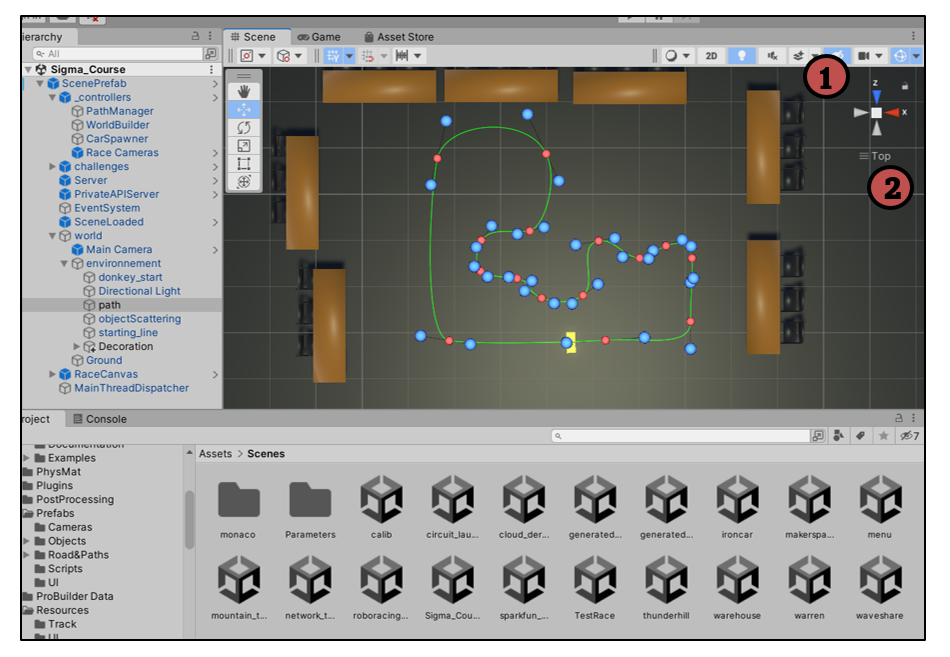

# ia\_racing\_imt

IA RACING - _Simulateur DonkeyCar_

**Destinataire :** Groupe projet 3A IMT Atlantique

**Auteurs :** Wyatt MARIN ([wyatt.marin@imt-atlantique.net](mailto:wyatt.marin@imt-atlantique.net))

**Date :** 20/03/2023 – année 2022-2023

Version 1.1

Table des matières

1. Prise en main
2. Organisation du projet
3. La scène sigma\_course
4. Ajouter / dupliquer une scène
5. Modifier la nouvelle scène
   1. Modifier la forme
   2. Modifier la texture
   3. Modifier la ligne d'arrivée
6. Ajouter la nouvelle piste au simulateur
7. Créer l'exécutable&#x20;

Un simulateur de la voiture Donkey est disponible en suivant les étapes sur le lien suivant : [https://docs.donkeycar.com/guide/deep\_learning/simulator/](https://docs.donkeycar.com/guide/deep\_learning/simulator/).

Comme celui-ci est développé sur le logiciel Unity (disponible sur ce lien : [https://store.unity.com/#plans-individual](https://store.unity.com/#plans-individual)), il est possible de le modifier pour, par exemple, avoir des pistes qui ressemblent plus à celle de Sigma.

Dans ce document seront détaillées les étapes principales pour pouvoir modifier ou ajouter une nouvelle piste ainsi que l’organisation globale du projet, et ce en détaillant les étapes pour qu’elles soient compréhensibles pour quelqu’un qui n’a jamais utilisé ce logiciel.

### PRISE EN MAIN 

Si vous avez déjà utilisé Unity, vous pouvez sauter cette partie, elle ne fait que préciser certaines bases du logiciel pour ceux qui le découvrent mais je conseille de tout de même regarder un tuto YouTube pour bien connaître comment il s’organise.

<figure><figcaption></figcaption></figure>

1. Arborescence de la scène : c’est ici que vous retrouverez tous les éléments présents dans la scène dont le nom est marqué en haut, ici c’est **menu**.
2. Rendu visuel de la scène : fenêtre principale où l’on peut voir les différents éléments de la scène
3. Inspector : c’est ici qu’apparaitront les différents paramètres des objets sur lesquels on clique (sa position, sa rotation, …)
4. Assets : fenêtre où l’on retrouve tous les fichiers du projet (les modèles 3d, les scripts, les différentes scènes,…)
5. Play : bouton permettant de tester la scène

### ORGANISATION DU PROJET 

Beaucoup d’éléments sont présent dans ce projet, ils ne sont malheureusement parfois pas très bien organisés et souvent peu utiles pour nous :

* **Les textures de route :**

Assets>Prefabs>Road\&Paths:

Ici on retrouve les prefabs nous permettant de générer la route, il y en a deux : pathelem et RoadPrefab.

Assets>Prefabs>Road\&Paths>Materials:

Ici se trouvent les textures appliquées sur la route des circuits. Il en existe 2 (RouteBasse et RouteHaute) qui sont exactement les mêmes mais miroitées par rapport à l’horizontale. L’idée est qu’il faut toujours avoir les deux bandes blanches vers l’extérieur de la course donc s’il arrivait que ça ne soit pas le cas avec l’une des textures, il suffit de prendre l’autre.

Assets>Prefabs>Road\&Paths>RoadImages:

Ici se trouve les deux images RouteBasse et RouteHaute qui sont utilisées pour les deux textures de même nom.

Assets>Materials:

Ici se trouve le Material de la ligne d’arrivée s’appelant « EndLine ».

* **Texture du sol :**

Assets>Materials:

Ici se trouve le Material du sol s’appelant tout simplement « Sol ».

* **Scripts ajoutés au projet initial :**

Assets>Prefabs>Scripts>AddedScript:

Ici se trouvent 3 scripts que j’ai rajouté : ChangeGroundColor, ChangeTextButton et HideObject qui nous sont utiles dans la scène SigmaCourse pour respectivement changer la couleur du sol avec un slider, mettre à jour la valeur de gris du sol et cacher ou afficher un objet.

Je conseille, si d’autres scripts devaient être rajoutés, de les mettre eux aussi dans ce dossier.

* **Images des circuits à afficher dans le menu :**

Assets>Ressources>UI:

Ici se trouvent des images des différentes courses, il y en a une pour chaque et sont celles qui seront affichées au-dessus de leurs noms dans le menu principal du simulateur lorsqu’on choisit sur laquelle on veut s’entrainer.

* **Toutes les scènes :**

Assets>Scenes:

Ici se trouvent toutes les scènes du projet. La scène « menu » est la scène principale, celle sur laquelle on tombe lorsqu’on lance le simulateur, elle devra donc être modifiée lorsque nous ajouterons une nouvelle scène, ce qu’on va voir dans la prochaine partie.

### LA SCÈNE SIGMA\_COURSE 

La scène que l’on utilisait le plus, parce qu’on l’avait modifiée pour qu’elle se rapproche de la réalité, était la scène Sigma\_course. Si vous lancez le simulateur présent dans le fichier (pas celui donné de base sur internet mais celui que nous avons modifié), vous pourrez trouver dans le menu la piste Sigma\_course, une scène dans laquelle la piste ressemble le plus possible à celle chez Sigma, dans laquelle des tables et des chaises ont été rajoutées (et peuvent être enlevés) et dans laquelle la couleur du sol peut être modifiée. Ces deux derniers paramètres permettent de placer l’algorithme dans différentes situations.

Je vous conseille de ne jamais modifier cette scène mais de la copier comme je l’explique dans la prochaine partie, ainsi, vous aurez toujours sous la main une scène qui initialement fonctionne.

### AJOUTER/DUPLIQUER UNE SCÈNE 

Pour ajouter une scène, il suffit de faire clic droit dans le dossier scène puis faire create>scene et de donner un nom à cette dernière. Après l’avoir ouverte en double cliquant dessus, vous devriez avoir ces éléments dans l’arborescence de votre scène&#x20;

<figure><figcaption></figcaption></figure>

Sélectionnez les deux éléments et supprimez-les, votre scène est alors vide. Je vous conseille de copier une scène déjà existante puis de modifier son contenu plutôt que de remettre un à un chaque élément au risque de se tromper ou d’en oublier. Malheureusement, il n’est pas possible de dupliquer une scène, d’où l’utilité de créer une nouvelle scène, de la vider et de copier le contenu d’une autre déjà existante. Pour faire cette dernière étape, vous allez devoir ouvrir deux scènes en même temps : gardez ouverte la nouvelle scène puis faites un glisser-déposer de la scène à copier depuis la zone 4 à la zone 1 (cf première image) , vous vous retrouvez alors dans cette situation :

<figure><figcaption></figcaption></figure>

Sélectionnez alors tous les éléments de la scène à copier (ici Sigma\_course) et collez les dans la nouvelle (ici New Scene). Fermez ensuite la scène à copier en faisant clic droit dessus puis Remove Scene, vous avez alors votre nouvelle scène.

### MODIFIER LA NOUVELLE SCÈNE 

Peuvent être modifiés dans la scène notamment la piste, le sol, le décor, ou n’importe quel autre élément.

Pour modifier le sol, il suffit de modifier directement sa texture dans les fichiers (Assets>Materials). C’est le script ChangeGroundColor qui permet de modifier la teinte en gris du sol à l’aide du slider, il peut donc être modifié en double-cliquant dessus.

Pour modifier le décor, vous pouvez soit dupliquer ou supprimer des éléments déjà présents, soit en rajouter depuis Assets>Prefabs>Objects, soit importer des modèles 3D depuis internet.

NB : il y a une différence entre un modèle 3D et un prefab, le premier n’est que le modèle, importé depuis internet ou l’Asset Store de Unity par exemple mais le deuxième est comme un exemplaire. Typiquement, vous pourriez avoir un modèle de tracteur vert mais avoir un prefab de ce même tracteur mais rouge et tourné de 90°. C’est ce prefab que vous allez ensuite rajouter et dupliquer dans votre scène et ainsi, lorsque vous apporterez une modification à celui-ci, tous les éléments dans la scène vont être modifiés en conséquence. (N’hésitez pas à regarder sur internet si vous ne connaissiez pas Unity)

Pour modifier la piste, plusieurs étapes sont à suivre :

### Modifier la forme : 

Pour modifier la forme de la piste, cliquez sur Path dans ScenePrefab>world>environnement comme sur l’image ci-dessous :

<figure><figcaption></figcaption></figure>

NB : pour vous mettre dans le même point de vue que celui montré, appuyé sur l’axe y au niveau de 1 puis sur Top au niveau de 2.

Les points rouges représentent les sommets et les points bleus les angles. Pour savoir en détail comment cela s’organise, notamment pour savoir comment rajouter ou modifier des points, vous pouvez lire la documentation présente dans Assets>PathCreator>Documentation.

NB : Je vous conseille de rester dans le point de vue dans lequel je suis, il vous permettra notamment de modifier les points dans le plan (x,z) et de ne pas modifier la position en y qui doit rester à 0 (ie, au niveau du sol). Lorsque vous cliquerez sur un point, vous verrez ce rectangle vert qui permet de ne le déplacer que sur le plan (x,z) :

Dans cette configuration, l’algorithme va générer la route en suivant le chemin créé. Pour voir s’il se génère comme il le faut, il suffit de Play en appuyant sur le bouton  en haut de l’écran, puis en allant de nouveau dans l’onglet Scene afin de pouvoir se déplacer (car Unity affichera automatiquement la fenêtre Game dans laquelle vous ne pourrez pas vous déplacer).

NB : Verifiez dans l’Inspector de ScenePrefab>\_controllers>PathManager que dans le script PathManager, Do Load Game Object Path soit coché et que pathelem soit présent dans la variable Pathelem (sinon rajouté le en le glissant déposant dans la case) :

### Modifier la texture 

Pour modifier la texture du circuit, il suffit d’aller dans ScenePrefab>\_controllers>WorldBuilder puis de mettre la texture de route désirée au niveau de l’élément 0 de Road Materials comme sur l’image ci-dessous (attention il faut mettre le Material et pas l’image png):

NB 1 : Vérifiez bien que RoadPrefab est présent dans Road Prefab Mesh.

NB 2 : Road Width permet de modifier la largeur de la route et Road Offset W et Road Height Offset permettent de décaler la piste par rapport au chemin dessiné respectivement selon la largeur et la longueur.

### Modifier la ligne d’arrivée 

Il suffit de modifier son Material « EndLine » comme on modifie le sol.

### AJOUTER LA NOUVELLE PISTE AU SIMULATEUR 

Pour ajouter la nouvelle piste au simulateur, il faut d’abord dire à Unity que cette nouvelle scène doit être chargée lorsqu’on demandera de Build le projet pour créer l’exécutable. Avec cette nouvelle scène ouverte, cliquez sur File>Build Settings, une fenêtre s’ouvrira, cliquez alors sur Add Open Scenes (la nouvelle scène apparaîtra alors dans la liste):

Désormais, il faut rajouter le circuit dans le menu pour pouvoir le sélectionner. Pour ça, ouvrez la scène menu en double-cliquant dessus. Cliquez sur \_TcpMenuController dans l’arborescence puis dans l’Inspector, cliquez sur le petit bouton « + » au bas de la liste Scene\_names dans le script Tcp Menu Handler pour rajouter un nouvel élément :

Rajoutez alors le nom de votre nouvelle scène dans le nouvel élément rajouté :

Il ne nous reste plus qu’à rajouter une image de notre scène dans le dossier Assets>Prefabs>Road\&Paths>RoadImages comme dit dans la partie 2.

### CRÉER L’EXÉCUTABLE 

Allez de nouveau dans File>Build Settings puis choisissez la bonne Target Platform et cliquez sur Build and Run, vous devrez alors designer le fichier dans lequel l’exécutable sera créer. Je vous conseille de créer un nouveau fichier nommer Builds. L’exécutable se lancera directement à la fin du chargement.
