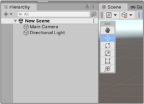

# ia\_racing\_imt

IA RACING - _Code START_

**Destinataire :** Groupe projet 3A IMT Atlantique

**Auteurs :** Wyatt MARIN ([wyatt.marin@imt-atlantique.net](mailto:wyatt.marin@imt-atlantique.net))

**Date :** 21/03/2023 – année 2022-2023

Version 1.1

1. Fonctionnement général
   1. Postulat
   2. Principe
2. Architecture
3. cutPicture
4. getRedRectangle / getGreenRectangle
5. isSameRectangle

Le projet se décompose en 3 parties principales : le START, le DRIVE et le STOP. Dans ce document, nous allons nous intéresser à la première, qui consiste à démarrer la voiture lorsque le feu rouge, passé au orange, passe finalement au vert. La technique choisie est d’utiliser la bibliothèque opencv pour détecter le feu rouge (ie un rectangle rouge) et repérer lorsqu’il passe au vert. Les seules entrées à lui fournir seront alors les images prises par la caméra et le programme finira par mettre à 1 la valeur d’une variable nommée launch\_car initialement à 0.

### FONCTIONNEMENT GÉNÉRAL 

### Postulat 

L’algorithme se base sur une hypothèse assez puissante, mais dont on pourra démontrer la véracité, qui est que le feu de départ représentera le plus grand rectangle rouge et vert que nous pourrons repérer avec la caméra. Le postulat part tout d’abord du principe que le feu est assez grand et assez proche de la voiture que nous pouvons, par ailleurs, placer où l’on souhaite derrière la ligne de départ. De plus, comme on coupe l’image en 2, on ne voit que la partie supérieure de l’image et donc le feu pratiquement tout l’espace à lui seul. Enfin, les paramètres ont été choisis (du moins nous avons essayé) de sorte que le programme ne détecte qu’une couleur rouge ou verte assez forte puisque le feu de départ est un panneau LED, peu soumis aux reflets typiquement.

### Principe 

Partant de cette hypothèse, l’algorithme va recevoir chaque image captée par la caméra et va directement couper celle-ci en deux pour ne garder que la partie supérieure en appelant cutPicture, puis, il va rechercher le plus grand carré rouge présent dans celle-ci (qu’on appelle ici Red\_detected) à l’aide de la fonction getRedRectangle.

A l’aide de la fonction IsSameRectangle, on compare ce rectangle Red\_detected avec Big\_red\_rect, le plus grand carré rouge qu’on avait détecté depuis maintenant et s’il s’avère que ce n’est pas le même alors si le premier est plus grand que le deuxième, alors on sauvegarde ses paramètres et il devient notre nouveau Big\_red\_rect.

Par la suite, le programme va rechercher le plus grand carré vert présent sur l’image (qu’on appelle ici Green\_detected) à l’aide de la fonction getGreenRectangle.

Encore une fois à l’aide de la fonction IsSameRectangle, on compare ce rectangle Green\_detected avec Big\_red\_rect, et si les deux sont les mêmes alors on dit à la voiture de démarrer.

### Architecture 

<figure><figcaption></figcaption></figure>

### cutPicture 

cutPicture récupère seulement l’image de base en INPUT, elle obtient ensuite la hauteur de l’image et retourne la moitié supérieure de celle-ci.

### getRedRectangle / getGreenRectangle 

Ces deux fonctions fonctionnent de la même manière à l’exception qu’elle ne travaille avec la même couleur (une en rouge, l’autre en vert). Globalement, la fonction récupère l’image qui est déjà coupée en deux, qu’elle va traiter et sur laquelle elle va appliquer un masque avec nos deux valeurs (low et high) correspondant à la couleur que l’on souhaite détecter (rouge ou vert) qui sont définies dans les paramètres du programme.

A l’aide de cv2.findContours, nous récupérons tous les rectangles (vert ou rouge) de l’image puis nous les parcourons tous un à un et si celui que l’on regarde est plus grand que le plus grand que nous avions trouvé, nous le sauvegardons comme étant le plus grand rectangle actuellement présent sur l’image en sauvegardant sa position, sa largeur et sa hauteur. A la fin, on retourne ses quatre paramètres.

### IsSameRectangle 

Dans les paramètres du programme, on définit une différence maximale (en %) que l’on accepte entre deux rectangles pour dire que ce sont les mêmes, elle s’appelle max\_diff et est égale ici à 10%. Dans IsSameRectangle, on calcule quatre quotients :

Avec :

* img\_width la largeur de l’image
* img\_height la hauteur de l’image
* respectivement la position en x et y, la largeur et la hauteur du rectangle i

Sachant que les paramètres sont donnés en INPUT de la fonction.

On calcule alors le maximum de ces 4 quotients et on retourne true si ce maximum ne dépasse pas max\_diff, et false sinon.
