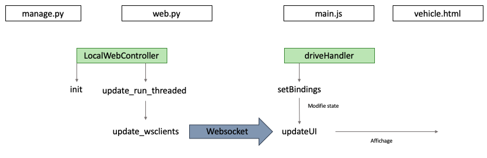
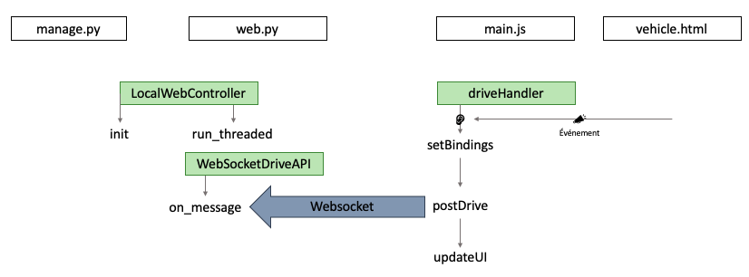

# Parts

Ce répertoire contient les parts que nous avons créées et/ou modifiées.

## IMTA_start

## IMTA_stop

## Preprocessing

## StopDetection

## SupervisedDrive

## Web Controllers

Nous n'avons pas crée la part webcontroller qui permet de générer un serveur web et les pages pour communiquer avec la voiture. Cependant, nous l'avons modifié pour mieux répondre à nos besoins.

La modification de l’interface graphique nécessite quelques connaissances élémentaires en développement web.

### Fichiers et ressources
#### Web controller
Il faut considérer 2 types de données, les données sortantes et les données entrantes. Par exemple, ce que nous appelons une donnée sortante est une donnée qui est affichée sur l’interface graphique et dont la valeur provient d’une autre part : l’image par exemple. Une donnée entrante serait plus une donnée communiquée à travers l’interface web vers la voiture à l’action de l’utilisateur : activer l’enregistrement, lancer le pilote automatique, vitesse en mode manuel, angle en mode manuel…

C’est la part ```web.py``` qui sert de web  controller qui prend en charge ces 2 types de données. Elle utilise Tornado pour :

- Créer un serveur web
- Définir des routages
- Créer un websocket qui servira à récupérer les données dynamiquement et faire communiquer l’interface web et la voiture

Le fichier ```web.py``` est composé de plusieurs classes :

- **LocalWebController :** est la clef de voûte de l’ensemble. Elle fonctionne en threaded (donc ne bloque pas l’exécution des autres parts exécutée par la voiture).
	1. Elle définit les routages :
		- ```/drive``` → utilisera la classe DriveAPI
		- ```/wdDrive``` → utilisera la classe WebSocketDriveAPI
		- ```/video``` → utilisera la classe VideoAPI
	2. Elle récupère les changements sur les données entrantes et les retourne.

- **DriveAPI :** Elle récupère les données entrantes envoyées par l’interface web par méthode POST et les enregistre. Ces données seront détectées comme changement ou pas par LocalWebController.
- **WebSocketDriveAPI :** Elle récupère les données entrantes envoyées par l’interface web à travers le websocket et les enregistre. Ces données seront détectées comme changement ou pas par LocalWebController.
- **VideoAPI :** elle génère l’image de la caméra et la met à jour régulièrement
- **… :** il y a d’autres classes dont nous n’avons pas eu l’utilité.

#### Templates
Il y a plusieurs templates existant, c’est-à-dire des pages html déjà construites qui permettent de structurer visuellement l’interface web. Elles se trouvent dans le dossier templates du répertoire donkeycar/parts/web_controller.
Seuls 2 templates nous ont été utiles :

- **base.html :** gère le thème global (en-tête par exemple)
- **vehicle.html :** correspond à l’interface globale dans sa quasi intégralité
```vehicle.html``` s’insère dans base.html pour être l’interface web de la conduite.

#### Ressources statiques
Le CSS utilisé pour rendre agréable l’interface visuelle est une ressource statique. C’est principalement du bootstrap qui est utilisé. L’interface est donc assez facilement modifiable dès lors que l’on comprend le fonctionnement de bootstrap (basé sur des lignes qui peuvent être séparées en 12 colonnes).

Le Javascript est aussi une ressource statique et il est intéressant de modifier le fichier main.js pour ajouter des données entrantes ou sortantes sur l’interface.

> __Note__ :

	Attention : après une modification du fichier main.js, il faut penser à vider le cache pour pouvoir observer l’effet de ses modifications.

**main.js** crée un objet driveHandler qui permet de gérer tout le drive :

- l’écoute d’événements (réception de données (sortantes) sur le websocket, clics sur les boutons, appuis sur les touches, etc.) avec la méthode setBindings.
- la modification de l’interface avec updateUI.
- envoie des données entrantes à travers le websocket
- les contrôles

### Modifier l'interface web
#### Ajouter une donnée sortante
Pour l’ajout d’une donnée sortante sur l’interface, cette section se propose d’introduire les modifications à réaliser en commençant par les données générées par le serveur jusqu’à l’implémentation dans l’interface. L’image suivante illustre l’appel des fichiers :



Pour ajouter l’affichage d’un donnée entrante, il y a 4 grandes étapes :

1. **Il faut modifier le ```web.py```**

	Dans ```web.py```, il faut changer les paramètres d’entrée du run et du run\_threaded de LocalWebController pour pouvoir les récupérer et les envoyer à travers le web\_socket.
Il faut ensuite mettre à jour la variable changes de run_threaded de LocalWebController. 

2. **Il faut modifier le ```manage.py```**

	Dans le ```manage.py``` il faut ajuster les inputs passés à LocalWebController.

3. **Il faut modifier ```vehicle.html```**

	Il faut préparer les balises qui seront remplies par les données entrantes souhaitées.

4. **Il faut modifier le ```main.js```**

	Dans le ```main.js```, ajouter des entrées dans la propriété state de driveHandler puis modifier updateUI. Les données reçues par le websocket seront ajoutées aux entrées de state. Par exemple, si je souhaite recevoir l’angle, je peux créer une entrée “angle” à None dans state puis vérifier si state.angle a une valeur dans updateUI pour l’afficher.

#### Ajouter une donnée entrante
Pour ajouter une donnée entrante, on doit écouter un événement qui générera la donnée (clic sur un bouton, appui sur une touche…).
À l’inverse de la précédente, cette partie se propose d’introduire les modifications à réaliser de l’interface vers le serveur car la donnée part de l’interface.



1. **Il faut modifier ```vehicle.html```**

	Il faut d’abord mettre en place les balises qui permettent de saisir la donnée. Cela peut être un formulaire, un bouton, etc.

2. **Il faut modifier le ```main.js```**

	Il faut écouter les événements liés à l’envoi de la donnée.
	
	D’abord il faut créer de nouvelles clefs et valeurs dans la propriété state de l’objet driveHandler (c’est l’initialisation des données). Puis, ajouter l’écoute d’événements dans setBindings. On peut s’inspirer du code déjà présent dans la méthode en l’adaptant pour correspondre à ce que l’on souhaite faire. 
	L’important étant de passer la donnée à envoyer en argument de postDrive.
	
	Enfin, il faut ajouter des case dans le switch de postDrive.

3. **Il faut modifier le ```web.py```**

	Dans ```web.py```, il faut modifier la méthode on_message de WebSocketDriveAPI. Les données reçues à travers le websocket sont récupérées en format json, décodées et stockées dans la variable data. On peut donc récupérer la donnée et la stocker dans self.application.
	Ensuite, il faut retourner cette donnée en sortie de run_threaded de LocalWebController. La variable self.application de WebSocketDriveAPI stocke les mêmes informations que la variable self de LocalWebController.

4. **Il faut modifier le ```manage.py```**

	Pour finir, il faut modifier les outputs de LocalWebController dans manage.py.
