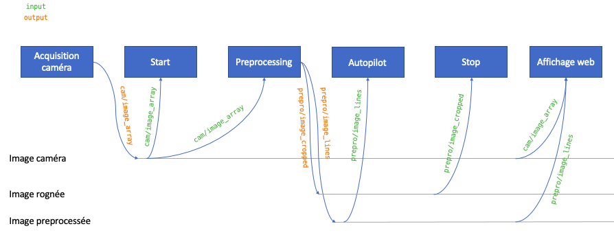

# Parts

Ce répertoire contient les parts que nous avons créées et/ou modifiées :

- IMTA_start
- IMTA_stop
- Preprocessing
- StopDetection
- SupervisedDrive
- Web Controllers

## IMTA_start

## IMTA_stop
### Principe

La part *imta_stop* permet de détecter la ligne de stop en repérant les couleurs dans une plage donnée. Lorsqu'on ne détecte pas la ligne alors qu'on l'avait détecté sur les images précédentes, on considère qu'on vient de compléter un tour.

La part prend en entrée :

- l'image de la caméra
- l'image préprocessée
- un booléen qui sert à arrêter le comptage de tour

La part retourne :

- une image avec la zone détectée (idéalement la ligne de stop)
- un booléen qui est vrai lorsque la ligne est détectée et faux sinon
- le nombre de tours complétés
- un booléen qui est vrai si la course est terminée

Il y a 5 étapes pour ajouter la part à la voiture :

1. On ajoute une part au framework
2. On ajoute une config spécifique à la voiture
3. On ajoute la part *imta_stop* aux parts exécutées par la voiture
4. On modifie les parts en lien avec l'interface visuelle pour afficher le compte des tours et arrêter le compte en cas d'erreurs

### 1. Créer de la part dans le framework donkeycar
Dans le framework donkeycar, copier le fichier ```imta_stop.py``` dans le répertoire ```donkeycar/parts```.

### 2. Ajouter la config spécifique à la voiture
Dans la voiture courante, ajouter les lignes suivantes dans le fichier ```myconfig.py``` (et ajuster les paramètres). Cela permettra :

- d'activer la part (*STOP_DETECTION*)
- de définir la plage de couleur acceptée pour la ligne de stop (*STOP\_LOWER\_YELLOW* et *STOP\_UPPER\_YELLOW*)
- de définir le nombre de tours à faire pendant la course (*LAP\_COUNTER\_MAX*)
- de définir le nombre de fois où l'on doit détecter la ligne avant de considérer qu'on passe un tour (cela évite les faux positifs) (*STOP\_DETECTION\_PREVIOUS\_IMG\_BASE*)

```python
STOP_DETECTION = True
STOP_LOWER_YELLOW = [10, 50, 20]
STOP_UPPER_YELLOW = [30, 200, 200]
STOP_YELLOW_AREA_MIN = 600
LAP_COUNTER_MAX = 20 # Si on commence avant la ligne, rajouter + 1
STOP_DETECTION_PREVIOUS_IMG_BASE = 15
```

Afin d'exécuter le preprocessing sur les images, ajouter les lignes suivantes dans la méthode *drive* du fichier ```cars/mycar/manage.py```. Le placer après le bloc de condition ```if cfg.SHOW_FPS:``` semble être un endroit satisfaisant.

### 3. Ajouter la part dans le script de la voiture

Afin d'ajouter la part à la voiture, ajouter les lignes suivantes dans la méthode *drive* du fichier ```cars/mycar/manage.py``` après le préprocessing (car l'un des inputs est l'output du preprocessing).

```python
if cfg.STOP_DETECTION:
	from donkeycar.parts.imta_stop import StopDetection
   	stop_detection = StopDetection(cfg)
   	V.add(stop_detection, inputs=['cam/image_array', 'prepro/image_cropped', 'stop_the_stop'], outputs=['cam/image_array', 'line', 'lap', 'end'])
```

En fin de définition de la méthode *drive*, ajouter les lignes suivantes pour faire s'arrêter la voiture lorsque la part *imta_stop* a détecté la fin de la course (en d'autres terme que le channel « end » est à True).

```python
if cfg.STOP_DETECTION:
	class StopCondition():
   		def __init__(self):
			self.alreadyEnded = False
                
		def run(self, throttle, end):
       	if end or self.alreadyEnded:
          	if self.alreadyEnded:
             		return 0.
				else:
             		self.alreadyEnded = True
                 	return -1.1*throttle # Pour faire un arret marqué
			else:
          	return throttle
        
	V.add(StopCondition(), inputs=['throttle', 'end'], outputs=['throttle'])
```

Dans ces lignes, on définit une part à la volée dans le ```manage.py``` qui sert à conditionner la valeur du throttle (c'est-à-dire de marche avant/arrière) de la voiture.

### 4. Modification de l'interface graphique

#### 4.1. Ajouter le compte tour sur l'interface

> __Note__ : pour bien comprendre cette section, il est conseillé de lire attentivement la partie sur les Web Controllers (à la fin de ce document).

> __Note__ : dans cette partie, nous ne verrons que l'ajout du compte tour et pas l'annonce de la fin de la course. La procédure est la même à quelques ajustements près.

Pour commencer, il faut passer le nombre de tour en input de l'interface graphique, c'est-à-dire en input de *LocalWebController*.

##### Récupérer les inputs

Il faut donc modifier le bloc suivant en rajoutant le channel "lap".

```python
ctr = LocalWebController(port=cfg.WEB_CONTROL_PORT, mode=cfg.WEB_INIT_MODE)
V.add(ctr,
		inputs=[input_image, 'tub/num_records', 'user/mode', 'recording'],
   		outputs=['user/angle', 'user/throttle', 'user/mode', 'recording', 'web/buttons'],
   		threaded=True)
```
devient

```python
ctr = LocalWebController(port=cfg.WEB_CONTROL_PORT, mode=cfg.WEB_INIT_MODE)
V.add(ctr,
		inputs=[input_image, 'tub/num_records', 'user/mode', 'recording', 'lap'],
   		outputs=['user/angle', 'user/throttle', 'user/mode', 'recording', 'web/buttons', 'stop_the_stop'],
   		threaded=True)
```

> __Note__ : on en profite pour anticiper la partie 4.2 et rajouter un output stop_the_stop que nous traiterons dans la partie suivante.

##### Intégrer les nouveaux inputs à la part de web control

Dans le fichier ```donkeycar/parts/web_controller/web.py```, modifier la méthode *run* et *run\_threaded* de *LocalWebController*.

```python
def run(self, img_arr=None, img_prepro = None, num_records=0, mode=None, recording=None, lapCounter = 0):
	return self.run_threaded(img_arr, img_prepro, num_records, mode, recording, lapCounter, end)
```

```python
def run_threaded(self, img_arr=None, img_prepro = None, num_records=0, mode=None, recording=None, lapCounter = 0):
```

Dans la méthode *run\_threaded*, ajouter le bloc suivant.

```python
if lapCounter != 0:
	changes["lapCounter"] = lapCounter
```

##### Modifier l'interface web

Pour finir, il faut modifier l'interface web. Pour cela, on va rajouter les balises qui conviennent dans le fichier ```donkeycar/parts/web_controller/template/vehicle.py```.

```html
<div class="col-md-4 text-center" style="color: greenyellow">
	<div class="row" style="font-size: 24px;">
   		<div class="col">
       	Nombre de tours
		</div>
	</div>
	<div class="row" style="font-size: 64px;">
   		<div class="col">
   			<p>
          	<span id="lap-counter">0</span>
			</p>
		</div>
	</div>
   	<div class="row" style="font-size: 64px;">
   		<div class="col">
       	<form id="stop-count_form" class="btn-group">
          	<button type="button" id="stop-count" class="btn btn-primary">Arrêter le compte</button>
			</form>
		</div>
	</div>
</div>
```
> __Note__ : À nouveau, on en profite pour anticiper la partie 4.2 et rajouter un bouton pour arrêter le compte des tours que nous traiterons dans la partie suivante. Dans cette partie, le plus important est de conserver ```<span id="lap-counter">0</span>```.

##### Mettre à jour l'interface web

Les éléments sont alors en place pour récupérer le nombre de tours grâce au websocket et les afficher sur l'interface. On ouvre alors ```donkeycar/parts/web_controller/template/static/main.js``` et on rajoute une entrée *lapCounter* à la propriété *state* de *driveHandler*. 

```js
var state = {
		…
        'lapCounter': 0,
		…
    }
```
où « … » indique des portions de codes non affichée dans le bloc de code ci-dessus.

Dans la méthode *updateUI*, on ajoute les lignes suivantes et le tour est joué !

```js
if(state.lapCounter) {
	$('#lap-counter').html(state.lapCounter.toFixed(0)); 
}
```

#### 4.2. Arrêter le compte tour depuis l'interface

Pour arrêter le compte tour depuis l'interface, on décide de créer un bouton sur l'interface graphique. Un événement écoutera le clic sur ce bouton et renverra un booléen à Vrai sur le channel "stop_the_stop" de la voiture.

##### Ajouter le bouton sur l'interface web

Bien qu'introduite antérieurement, l'élément primordial à ajouter à ```donkeycar/parts/web_controller/template/vehicle.py``` sont les balises suivantes.

```html
<form id="stop-count_form" class="btn-group">
	<button type="button" id="stop-count" class="btn btn-primary">Arrêter le compte</button>
</form>
```

##### Écouter l'événement

Pour écouter l'événement, il suffit de rajouter une entrée *stopCount* à la propriété *state* de *driveHandler* dans le fichier ```donkeycar/parts/web_controller/template/static/main.js``` et de rajouter l'écoute du clic dans la méthode *setBindings* de *driveHandler*.

```js
var state = {
		…
        'stopCount': false,
		…
    }
```
(où « … » indique des portions de codes non affichée dans le bloc de code ci-dessus)

```js
$('#stop-count_form > button').click(function() {
   	state.stopCount = true;
   	postDrive(["stopCount"]); // write it back to the server
});
```
Lorsqu'on clique sur le bouton, la propriété *state.stopCount* est modifiée à vraie et on l'envoie à travers le websocket.

##### Envoi à travers le websocket

Pour réaliser l'envoi à travers le websocket, il faut rajouter un *case* au *switch* de la méthode *postDrive* dans *driveHandler* dans le fichier ```donkeycar/parts/web_controller/template/static/main.js```.

```js
case 'stopCount': data['stopCount'] = state.stopCount; break;
```

##### Récupérer la décision

Pour récupérer la donnée transitant à travers le websocket, il faut modifier ```donkeycar/parts/web_controller/web.py```.

Dans le constructeur (*\_\_init\_\_*) de *LocalWebController*, il faut ajouter une propriété *stopCount* définie par défaut à False.

```python
self.stopCount = False
```

Dans la méthode *on_message* de la classe *WebSocketDriveAPI*, il faut rajouter les lignes suivantes à la fin de la méthode.

```python
if data.get('stopCount') is not None:
	self.application.stopCount = data['stopCount']
```

##### Retourner la décision

Dans la méthode *run\_threaded* de *LocalWebController*, il faut ajouter la ligne suivante à la méthode.

```python
stopCount = self.stopCount
```

Enfin, il faut changer les valeurs de retour de *run\_threaded* de *LocalWebController* en :

```python
return self.angle, self.throttle, self.mode, self.recording, buttons, stopCount
```

##### Créer l'output

Pour conclure, dans le fichier ```cars/mycar/manage.py```, modifier les outputs de la part LocalWebController tel que

```python
outputs=['user/angle', 'user/throttle', 'user/mode', 'recording', 'web/buttons', 'stop_the_stop']
```


## Preprocessing
Pour intégrer le préprocessing, il y a plusieurs fichiers à modifier.

1. On ajoute une part au framework
2. On ajoute une config spécifique à la voiture
3. On ajoute la part preprocessing aux parts exécutées par la voiture
4. On envoie les images preprocessées au modèle de conduite
5. On modifie les parts en lien avec l'interface visuelle

La partie 6. rappelle comment lancer un modèle et permet de s'assurer que les changements ont correctement été effectués.

### Principe

Le preprocessing est réalisé par une part créée maison. Elle doit donc être intégrée au framework et dans les parts exécutées par la voiture.

Lors du développement du preprocessing (de l'équipe supervisée), le choix a été fait de conserver l'image brute de la caméra intacte dans le « channel » ```cam/image_array```. Un autre « channel » ```prepro/image_cropped``` a été créé pour récupérer l'image brute rognée (qui peut servir à la partie stop). Un « channel » ```prepro/image_lines``` a également été créé pour récupérer l'image à l'issue du preprocessing complet. C'est donc ```prepro/image_lines``` qui sera à passer au modèle de conduite supervisée. La création d'un channel propre et le choix du nom du channel est arbitraire et peut être ajusté facilement.



Dans cette section, nous verrons :

- comment intégrer le preprocessing dans donkeycar pour transformer les images acquises par la caméra
- comment les communiquer au modèle
- comment avoir un rendu visuel du preprocessing sur l'interface web

### 1. Créer de la part dans le framework donkeycar
Dans le framework donkeycar, copier le fichier ```preprocessing.py``` dans le répertoire ```donkeycar/parts```.

### 2. Ajouter la config spécifique à la voiture
Dans la voiture courante, ajouter les lignes suivantes dans le fichier ```myconfig.py``` (et ajuster les paramètres). Cela permettra d'activer le preprocessing et de régler le niveau de crop ainsi que la méthode de preprocessing. Bien sûr, lorsqu'on souhaite faire rouler la voiture en automatique, il faut que le modèle qui tourne ait été entrainé avec les mêmes paramètres de configuration, sinon cela créera une erreur.

```python
PREPROCESSING = True
PREPROCESSED_CROP_FROM_TOP = 40
PREPROCESSING_METHOD = "lines" # throttle150|throttle195|canny150|canny195|contour150|contour195|lines
```

Il a été choisi de désigner chaque préprocessing par un nom propre. Dans la part, un if-elif permet d'appeler le preprocessing choisi.


### 3. Ajouter la part dans le script de la voiture

Afin d'exécuter le preprocessing sur les images, ajouter les lignes suivantes dans la méthode *drive* du fichier ```cars/mycar/manage.py```. Le placer après le bloc de condition ```if cfg.SHOW_FPS:``` semble être un endroit satisfaisant.

```python
if cfg.PREPROCESSING:
	from donkeycar.parts.preprocessing import Preprocessing
	prepro = Preprocessing(cfg)
	V.add(prepro, inputs=['cam/image_array'], outputs=['prepro/image_cropped', 'prepro/image_lines'])
```

> __Warning__ : ce qu'il faut c'est placer l'appel de la part après la création du channel *'cam/image\_array'* (par la part camera) et avant l'appel du modèle pour que ce dernier puisse récupérer l'image traitée.

### 4. Envoyer les images preprocessées au modèle

Dans ```cars/mycar/manage.py```, repérer le bloc de code suivant :

```python
if cfg.TRAIN_BEHAVIORS:
	bh = BehaviorPart(cfg.BEHAVIOR_LIST)
	V.add(bh, outputs=['behavior/state', 'behavior/label', "behavior/one_hot_state_array"])
	try:
		ctr.set_button_down_trigger('L1', bh.increment_state)
	except:
		pass

	inputs = ['cam/image_array', "behavior/one_hot_state_array"]

elif cfg.USE_LIDAR:
	inputs = ['cam/image_array', 'lidar/dist_array']

elif cfg.HAVE_ODOM:
	inputs = ['cam/image_array', 'enc/speed']

elif model_type == "imu":
	assert cfg.HAVE_IMU, 'Missing imu parameter in config'
	# Run the pilot if the mode is not user.
	inputs = ['cam/image_array',
			'imu/acl_x', 'imu/acl_y', 'imu/acl_z',
			'imu/gyr_x', 'imu/gyr_y', 'imu/gyr_z']
else:
	inputs = ['cam/image_array']
```

Le modifier en changeant l'input dans le *else*, tel que présenté ci-après (notons que « … » indique une partie de code à ne pas changer) :

```python
if cfg.TRAIN_BEHAVIORS:
	…
else:
	if cfg.PREPROCESSING:
		inputs = ['prepro/image_lines']
	else:
		inputs = ['cam/image_array']
```

### 5. Modifier les parts en lien avec l'interface visuelle

#### 5.1. Passer l'image préprocessée en entrée de l'interface graphique

Dans ```cars/mycar/manage.py```, modifier la définition de *add\_user\_controller* en changeant les paramètres. Initialement, on a :

```python
def add_user_controller(V, cfg, use_joystick, input_image='cam/image_array'):
```

Rajouter un paramètre *input\_prepro\_image* :

```python
def add_user_controller(V, cfg, use_joystick, input_image='cam/image_array', input_prepro_image = 'prepro/image_lines'):
```

Dans ```cars/mycar/manage.py```, modifier les entrées et les sorties de *LocalWebController*. Initialement, on a :

```python
ctr = LocalWebController(port=cfg.WEB_CONTROL_PORT, mode=cfg.WEB_INIT_MODE)
V.add(ctr,
	inputs=[input_image, 'tub/num_records', 'user/mode', 'recording'],
	outputs=['user/angle', 'user/throttle', 'user/mode', 'recording', 'web/buttons'],
	threaded=True)
```

Modifier ce bloc de code par :

```python
ctr = LocalWebController(port=cfg.WEB_CONTROL_PORT, mode=cfg.WEB_INIT_MODE)
V.add(ctr,
	inputs=[input_image, input_prepro_image, 'tub/num_records', 'user/mode', 'recording'],
	outputs=['user/angle', 'user/throttle', 'user/mode', 'recording', 'web/buttons', 'stopCount'],
	threaded=True)
```

Dans ```donkeycar/donkeycar/web_controller/web.py```, modifier les paramètres de la méthode *run* et *run\_threaded*. Pour *run*, on a initialement

```python
def run(self, img_arr=None, num_records=0, mode=None, recording=None):
	return self.run_threaded(img_arr, num_records, mode, recording)
```
qu'il faut modifier en

```python
def run(self, img_arr=None, img_prepro = None, num_records=0, mode=None, recording=None):
	return self.run_threaded(img_arr, img_prepro, num_records, mode, recording)
```

Pour *run\_threaded*, on a initialement

```python
def run_threaded(self, img_arr=None, num_records=0, mode=None, recording=None):
```

qu'il faut modifier en

```python
def run_threaded(self, img_arr=None, img_prepro = None, num_records=0, mode=None, recording=None):
```

#### 5.2. Générer l'image préprocessée

Pour l'instant, l'image préprocessée est un array, on ne peut donc pas la visualiser. Nous allons créer la classe *VideoPreproAPI* qui aura pour rôle de la générer et de rendre l'affichage disponible. En définissant correctement les handleurs de *LocalWebController* on pourra la récupérer à une URL donnée.

Dans la méthode *run\_threaded*, ajouter ```self.img_prepro = img_prepro``` à la ligne après ```self.img_arr = img_arr```.

Dans le fichier ```donkeycar/donkeycar/web_controller/web.py```, ajouter la classe suivante :

```python
class VideoPreproAPI(RequestHandler):
    '''
    Serves a MJPEG of the images posted from the vehicle after preprocessing.
    '''

	async def get(self):

        self.set_header("Content-type",
                        "multipart/x-mixed-replace;boundary=--boundarydonotcross")

        served_image_timestamp = time.time()
        my_boundary = "--boundarydonotcross\n"
        while True:

            interval = .01
            if served_image_timestamp + interval < time.time() and \
                    hasattr(self.application, 'img_prepro'):
                img = utils.arr_to_binary(self.application.img_prepro)
                self.write(my_boundary)
                self.write("Content-type: image/jpeg\r\n")
                self.write("Content-length: %s\r\n\r\n" % len(img))
                self.write(img)
                served_image_timestamp = time.time()
                try:
                    await self.flush()
                except tornado.iostream.StreamClosedError:
                    pass
            else:
                await tornado.gen.sleep(interval)
```

Enfin, ajouter l'entrée suivante dans les *handlers* de la méthode *\_\_init\_\_* de la class *LocalWebController* :

```python	
(r"/video_prepro", VideoPreproAPI)
```

ce qui donne :

```python
handlers = [
            (r"/", RedirectHandler, dict(url="/drive")),
            (r"/drive", DriveAPI),
            (r"/wsDrive", WebSocketDriveAPI),
            (r"/wsCalibrate", WebSocketCalibrateAPI),
            (r"/calibrate", CalibrateHandler),
            (r"/video", VideoAPI),
            (r"/video_prepro", VideoPreproAPI),
            (r"/wsTest", WsTest),
            (r"/static/(.*)", StaticFileHandler,
             {"path": self.static_file_path}),
        ]
```

On peut donc désormais récupérer l'image à l'adresse http://localhost:8887/video_prepro

#### 5.3. Modifier l'interface web

Pour afficher l'image sur l'interface web, il suffit de rajouter une balise img qui charge l'image à l'adresse http://localhost:8887/video_prepro dans le fichier ```donkeycar/donkeycar/web_controller/templates/vehicle.html```

```html

```

## StopDetection

StopDetection est une part qui permet de détecter la ligne de stop en utilisant un modèle de classification binaire. Pour l'intégrer, il y a 4 fichiers à modifier :

1. On ajoute une part au framework
2. On ajoute le modèle entrainé
3. On ajoute une config spécifique à la voiture
4. On ajoute une section dans l'exécution de la voiture


### 1. Créer de la part dans le framework donkeycar
Dans le framework donkeycar, copier le fichier *stop_detection.py* dans le répertoire *parts* de *donkeycar*.

### 2. Ajouter le modèle entrainé
Dans la voiture courante, copier le fichier *sigmoid-10e.pth* dans le répertoire *models*.

### 3. Ajouter la config spécifique à la voiture
Dans la voiture courante, ajouter les lignes suivantes à la fin du fichier *myconfig.py* (et ajuster les paramètres) :

```python
STOP_DETECTION = True # Active la part de détection de la ligne stop
STOP_DETECTION_MODEL_PATH = "<chemin du modele>"  # Chemin du modele entraine
STOP_DETECTION_DEVICE = "cpu" # device sur lequel on utilise le modele
THROTTLE_STOP_DETECTION = 0.9 # la probabilité acceptable pour considérer qu'il y a une ligne
LAP_COUNTER_MAX = 6 # Nombre de tours avant l'arret force du vehicule
STOP_DETECTION_PREVIOUS_IMG_BASE = 3 # Nombre d'images avec ligne pour considerer qu'on a passe la ligne
STOP_DETECTION_PRINT = True # Affichage des moments de detection de ligne
```


### 4. Ajouter la part dans le script de la voiture

Dans la voiture courante, ajouter les lignes suivantes à la fin de la méthode *drive* du fichier *manage.py* (dans mon cas, à la ligne 572).

```python
if cfg.STOP_DETECTION
	from donkeycar.parts.stop_detection import StopDetection
	stop_detection = StopDetection(cfg)
	V.add(stop_detection, inputs=['cam/image_array', 'throttle'], outputs=['throttle', 'lap', 'end'])
```

## SupervisedDrive [échec]

> __Warning__ : les résultats obtenus avec ce modèle étaient médiocres. Nous n'avons pas choisi de conserver cette part. Elle est introduite dans le présent document pour illustrer comment ajouter une part de pilote supervisé.

> __Note__ : Le modèle de conduite supervisée est basé sur une architecture de type resnet.

Pour intégrer la conduite supervisée, il y a 4 fichiers à modifier.

1. On ajoute une part au framework
2. On ajoute le resnet entrainé
3. On ajoute une config spécifique à la voiture
4. On ajoute une section dans l'exécution de la voiture


### 1. Créer de la part dans le framework donkeycar
Dans le framework donkeycar, copier le fichier *supervised_driver.py* dans le répertoire *parts* de *donkeycar*.

### 2. Ajouter le modèle entrainé
Dans la voiture courante, déplacer le modèle entrainé dans le fichier *XXXXXXX.torch* dans le répertoire *models*.

### 3. Ajouter la config spécifique à la voiture
Dans la voiture courante, ajouter les lignes suivantes à la fin du fichier *myconfig.py* (et ajuster les paramètres) :

```python
SUPERVISED_DRIVER = True
SUPERVISED_DEVICE = "cpu"
SUPERVISED_STATE_DICT_PATH = "./models/XXXXXX.torch"
SUPERVISED_THROTTLE_MAX = 0.5
SUPERVISED_ANGLE_MAX = 1
```

et ajuster ce qui doit être modifié :

- le device d'exécution (ex : sur la GPU si besoin)
- *XXXXXX.torch* par le modèle choisi en 2.

### 4. Ajouter la part dans le script de la voiture

Dans la voiture courante, ajouter les lignes suivantes dans la méthode *drive* du fichier *manage.py* (dans mon cas, à la ligne 458) pour être après l'appel de la part *DriveMode*.
```python
if cfg.SUPERVISED_DRIVER:
	from donkeycar.parts.supervised_driver import SupervisedDrive
   	s_driver = SupervisedDrive(cfg)
   	V.add(s_driver, inputs=['cam/image_array'], outputs=['throttle', 'angle'])
```

## Web Controllers

Nous n'avons pas crée la part webcontroller qui permet de générer un serveur web et les pages pour communiquer avec la voiture. Cependant, nous l'avons modifié pour mieux répondre à nos besoins.

La modification de l’interface graphique nécessite quelques connaissances élémentaires en développement web.

### Fichiers et ressources
#### Web controller
Il faut considérer 2 types de données, les données sortantes et les données entrantes. Par exemple, ce que nous appelons une donnée sortante est une donnée qui est affichée sur l’interface graphique et dont la valeur provient d’une autre part : l’image par exemple. Une donnée entrante serait plus une donnée communiquée à travers l’interface web vers la voiture à l’action de l’utilisateur : activer l’enregistrement, lancer le pilote automatique, vitesse en mode manuel, angle en mode manuel…

C’est la part ```web.py``` qui sert de web  controller qui prend en charge ces 2 types de données. Elle utilise Tornado pour :

- Créer un serveur web
- Définir des routages
- Créer un websocket qui servira à récupérer les données dynamiquement et faire communiquer l’interface web et la voiture

Le fichier ```web.py``` est composé de plusieurs classes :

- **LocalWebController :** est la clef de voûte de l’ensemble. Elle fonctionne en threaded (donc ne bloque pas l’exécution des autres parts exécutée par la voiture).
	1. Elle définit les routages :
		- ```/drive``` → utilisera la classe DriveAPI
		- ```/wdDrive``` → utilisera la classe WebSocketDriveAPI
		- ```/video``` → utilisera la classe VideoAPI
	2. Elle récupère les changements sur les données entrantes et les retourne.

- **DriveAPI :** Elle récupère les données entrantes envoyées par l’interface web par méthode POST et les enregistre. Ces données seront détectées comme changement ou pas par LocalWebController.
- **WebSocketDriveAPI :** Elle récupère les données entrantes envoyées par l’interface web à travers le websocket et les enregistre. Ces données seront détectées comme changement ou pas par LocalWebController.
- **VideoAPI :** elle génère l’image de la caméra et la met à jour régulièrement
- **… :** il y a d’autres classes dont nous n’avons pas eu l’utilité.

#### Templates
Il y a plusieurs templates existant, c’est-à-dire des pages html déjà construites qui permettent de structurer visuellement l’interface web. Elles se trouvent dans le dossier templates du répertoire donkeycar/parts/web_controller.
Seuls 2 templates nous ont été utiles :

- **base.html :** gère le thème global (en-tête par exemple)
- **vehicle.html :** correspond à l’interface globale dans sa quasi intégralité
```vehicle.html``` s’insère dans base.html pour être l’interface web de la conduite.

#### Ressources statiques
Le CSS utilisé pour rendre agréable l’interface visuelle est une ressource statique. C’est principalement du bootstrap qui est utilisé. L’interface est donc assez facilement modifiable dès lors que l’on comprend le fonctionnement de bootstrap (basé sur des lignes qui peuvent être séparées en 12 colonnes).

Le Javascript est aussi une ressource statique et il est intéressant de modifier le fichier main.js pour ajouter des données entrantes ou sortantes sur l’interface.

> __Warning__ : après une modification du fichier ```main.js```, il faut penser à vider le cache pour pouvoir observer l’effet de ses modifications.

**main.js** crée un objet driveHandler qui permet de gérer tout le drive :

- l’écoute d’événements (réception de données (sortantes) sur le websocket, clics sur les boutons, appuis sur les touches, etc.) avec la méthode setBindings.
- la modification de l’interface avec updateUI.
- envoie des données entrantes à travers le websocket
- les contrôles

### Modifier l'interface web
#### Ajouter une donnée sortante
Pour l’ajout d’une donnée sortante sur l’interface, cette section se propose d’introduire les modifications à réaliser en commençant par les données générées par le serveur jusqu’à l’implémentation dans l’interface. L’image suivante illustre l’appel des fichiers :


Pour ajouter l’affichage d’un donnée entrante, il y a 4 grandes étapes :

1. **Il faut modifier le ```web.py```**

	Dans ```web.py```, il faut changer les paramètres d’entrée du *run* et du *run\_threaded* de *LocalWebController* pour pouvoir les récupérer et les envoyer à travers le web\_socket.
Il faut ensuite mettre à jour la variable changes de *run\_threaded* de *LocalWebController*. 

2. **Il faut modifier le ```manage.py```**

	Dans le ```manage.py``` il faut ajuster les inputs passés à *LocalWebController*.

3. **Il faut modifier ```vehicle.html```**

	Il faut préparer les balises qui seront remplies par les données entrantes souhaitées.

4. **Il faut modifier le ```main.js```**

	Dans le ```main.js```, ajouter des entrées dans la propriété *state* de *driveHandler* puis modifier *updateUI*. Les données reçues par le websocket seront ajoutées aux entrées de *state*. Par exemple, si je souhaite recevoir l’angle, je peux créer une entrée “*angle*” à None dans *state* puis vérifier si *state.angle* a une valeur dans *updateUI* pour l’afficher.

#### Ajouter une donnée entrante
Pour ajouter une donnée entrante, on doit écouter un événement qui générera la donnée (clic sur un bouton, appui sur une touche…).
À l’inverse de la précédente, cette partie se propose d’introduire les modifications à réaliser de l’interface vers le serveur car la donnée part de l’interface.


1. **Il faut modifier ```vehicle.html```**

	Il faut d’abord mettre en place les balises qui permettent de saisir la donnée. Cela peut être un formulaire, un bouton, etc.

2. **Il faut modifier le ```main.js```**

	Il faut écouter les événements liés à l’envoi de la donnée.
	
	D’abord il faut créer de nouvelles clefs et valeurs dans la propriété state de l’objet *driveHandler* (c’est l’initialisation des données). Puis, ajouter l’écoute d’événements dans *setBindings*. On peut s’inspirer du code déjà présent dans la méthode en l’adaptant pour correspondre à ce que l’on souhaite faire. 
	L’important étant de passer la donnée à envoyer en argument de *postDrive*.
	
	Enfin, il faut ajouter des case dans le switch de *postDrive*.

3. **Il faut modifier le ```web.py```**

	Dans ```web.py```, il faut modifier la méthode *on\_message* de *WebSocketDriveAPI*. Les données reçues à travers le websocket sont récupérées en format json, décodées et stockées dans la variable data. On peut donc récupérer la donnée et la stocker dans self.application.
	Ensuite, il faut retourner cette donnée en sortie de *run\_threaded* de *LocalWebController*. La variable *self.application* de *WebSocketDriveAPI* stocke les mêmes informations que la propriété *self* de *LocalWebController*.

4. **Il faut modifier le ```manage.py```**

	Pour finir, il faut modifier les outputs de *LocalWebController* dans ```manage.py```.
