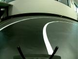

# Camera Calibration

The calibration of the camera lens is needed only when you intend to use a model trained with a simulator ([Reinforcement](https://github.com/Rom-1T/ia_racing_imt/tree/main/drive_renforcement)) as you need to make the reality look alike the simulation by, for instance, removing the fisheye effect.

### Installation and set-up

This part can be done on the host pc. See [Usage for the rapsberry pi integration](https://github.com/Rom-1T/ia_racing_imt/tree/main/integration).

#### Install library
```
//Conda install
conda install -c conda-forge opencv
```
```
//pip install
pip install opencv-python
```

#### Print checkerboard

The calibration method use image detection for distortion parameters identification. This method is based on 3D line distortion on the checkerboard.

Download and print a checkerboard on the website : [https://markhedleyjones.com/projects/calibration-checkerboard-collection](https://markhedleyjones.com/projects/calibration-checkerboard-collection)

Don't forget to write down the verticies dimension as it is an input of the python script. For example we have tested the "[A4 - 35mm squares - 7x4 verticies, 8x5 squares](https://raw.githubusercontent.com/MarkHedleyJones/markhedleyjones.github.io/master/media/calibration-checkerboard-collection/Checkerboard-A4-35mm-7x4.pdf)"

#### Create a set of images

Lens calibration uses a set of images taken by the same camera/lens, each one showing a checkerboard pattern in a different position, so that taken collectively, the checkerboard appears in almost entire field of view. The more images, the more accurate the calibration will be, but typically 10 to 15 images suffice.

 

It is possible to use the script _take\_picture\_rasp.py_ to create the set of images.

#### Calibrate the camera lens

Now it is time to use the script _calibrate\_cam.py._

Take the images set and put it in the same directory as _calibrate\_cam.py._ In this script input the checkerboard vertices on line 8 : CHECKERBOARD = (4,7).

```
// Example of the output

Found 6 valid images for calibration
DIM=(160, 120)
K=np.array([[76.40210369377033, 0.0, 85.17741324657462], [0.0, 75.55575570884872, 61.5111216120113], [0.0, 0.0, 1.0]])
D=np.array([[0.032858036745614], [-0.09739958496116238], [0.07344214252074698], [-0.02977154953395648]])

Process finished with exit code 0

```

Save the 3 output (DIM, K and D).

### Usage and donkey car integration

#### Example

To unfish the images, you can use the example _undistort.py._ Replace (DIM,K and D) with the output of the calibration and it is done.

 

#### Modify the camera part

The first step is to modify the camera part. In the framework, the output of the camera part is a _frame_ from the _raw\_capture_. We just need to modify use the _undistort_ function before outputing the frame.

```
// Create the undistort function 

import cv2
DIM=(160, 120)
K=np.array([[76.40210369377033, 0.0, 85.17741324657462], [0.0, 75.55575570884872, 61.5111216120113], [0.0, 0.0, 1.0]])
D=np.array([[0.032858036745614], [-0.09739958496116238], [0.07344214252074698], [-0.02977154953395648]])
def undistort(img_array):
    map1, map2 = cv2.fisheye.initUndistortRectifyMap(K, D, np.eye(3), K, DIM, cv2.CV_16SC2)
    undistorted_img = cv2.remap(img_array, map1, map2, interpolation=cv2.INTER_LINEAR, borderMode=cv2.BORDER_CONSTANT)
    return undistorted_img
```

```
// Modify the output of run_threaded if you use threaded=True
//in the manage.py
//Modify the run otherwise

class BaseCamera:
    def run_threaded(self):
        if self.undistort :
            return undistort(self.frame)
        else :
            return self.frame
```


```
// Add the undistort parameter in the creation of the camera
//part

class PiCamera(BaseCamera):
    def __init__(self, image_w=160, image_h=120, image_d=3, framerate=20, vflip=False, hflip=False, undistort=False):
        from picamera.array import PiRGBArray
        from picamera import PiCamera

        resolution = (image_w, image_h)
        # initialize the camera and stream
        self.undistort = True
        self.camera = PiCamera() #PiCamera gets resolution (height, width)
        self.camera.resolution = resolution
        self.camera.framerate = framerate
        self.camera.vflip = vflip
        self.camera.hflip = hflip
        self.undistort = undistort
        self.rawCapture = PiRGBArray(self.camera, size=resolution)
        self.stream = self.camera.capture_continuous(self.rawCapture,
            format="rgb", use_video_port=True)

        # initialize the frame and the variable used to indicate
        # if the thread should be stopped
        self.frame = None
        self.on = True
        self.image_d = image_d

        # get the first frame or timeout
        logger.info('PiCamera loaded...')
        if self.stream is not None:
            logger.info('PiCamera opened...')
            warming_time = time.time() + 5  # quick after 5 seconds
            while self.frame is None and time.time() < warming_time:
                logger.info("...warming camera")
                self.run()
                time.sleep(0.2)

            if self.frame is None:
                raise CameraError("Unable to start PiCamera.")
        else:
            raise CameraError("Unable to open PiCamera.")
        logger.info("PiCamera ready.")
```

#### Modify the myconfig.py and the manage.py

You need to add a parameter to the myconfig.py so it can turn off or on the _undistort._

```
// In the myconfig.py
#CAMERA
CAMERA_TYPE = "PICAM"   # (PICAM|WEBCAM|CVCAM|CSIC|V4L|D435|MOCK|IMAGE_LIST)
IMAGE_W = 160
IMAGE_H = 120
IMAGE_DEPTH = 3         # default RGB=3, make 1 for mono
CAMERA_FRAMERATE = 20
CAMERA_VFLIP = True
CAMERA_HFLIP = True
UNDISTORT = True
```

```
// In the manage.py
        if cfg.CAMERA_TYPE == "PICAM":
            from donkeycar.parts.camera import PiCamera
            cam = PiCamera(image_w=cfg.IMAGE_W, image_h=cfg.IMAGE_H, image_d=cfg.IMAGE_DEPTH,
                           framerate=cfg.CAMERA_FRAMERATE,
                           vflip=cfg.CAMERA_VFLIP, hflip=cfg.CAMERA_HFLIP, undistort=cfg.UNDISTORT)

```

If everything is done correclty, you should be able to see the undistort filter on the camera output in the webcontroller.
