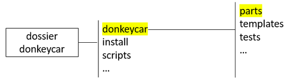
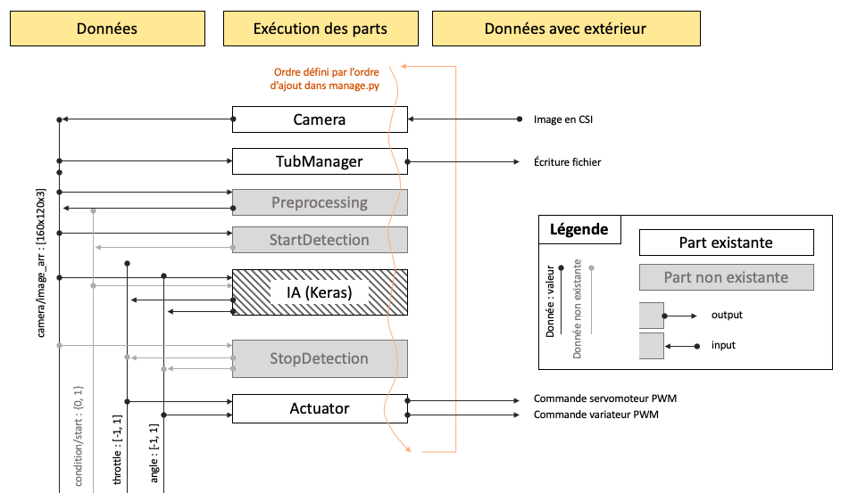
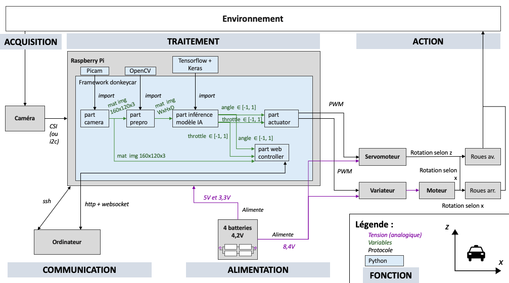

# Framework donkeycar

## Présentation de la bibliothèque

La bibliothèque (framework) donkeycar a été centrale au projet. C’est une bibliothèque Open-source nourrit par une communauté active qui inclut un ensemble de classes python pour contrôler la voiture. Elle permet de récupérer les images de la caméra, d’actionner les moteurs, de rendre la voiture autonome, etc.

Il est possible de se passer de donkeycar mais la charge de travail serait beaucoup plus conséquente.

## Installation

Pour installer donkeycar, la [documentation](https://docs.donkeycar.com/guide/install_software/#step-1-install-software-on-host-pc) est bien faite.

Il faut juste faire attention à deux ou trois points :

- Télécharger la “stable version” de la bibliothèque (des problèmes peuvent apparaître avec la “latest version”)

- Si vous disposez d’un ordinateur avec une carte graphique NVidia il est fortement recommandé d’installer CUDA (voir partie installation CUDA)


## Structure du framework

Le framework se structure en fichiers et répertoires dont les plus importants sont ```vehicle.py``` et le répertoire ```parts```.



### Vehicle.py

À la racine du framework, le fichier vehicle.py définit les méthodes permettant d’ajouter des parts, de définir leurs données d’entrée et de sortie, de vérifier leurs conditions d’exécution, et de les exécuter.

### Parts

Le répertoire “parts” est le plus important. Les parts sont les différents modules intégrés à la bibliothèque Donkeycar. Elles contiennent notamment les programmes nécessaires à la conduite autonome. Ces parts sont exécutées les unes après les autres lors de la conduite. Il sera utile de rajouter de nouvelles parts pour répondre à certains besoins (par exemple, détection de la ligne de stop ou du feu).

Parmi les parts, on peut en lister quelques unes importantes :

- camera.py : qui permet de récupérer l’image de la caméra
- TubManager dans tub_v2.py : qui permet d’enregistrer les images, la vitesse et l’angle de la voiture lorsqu’elle roule
- KerasPilot dans keras.py + KerasInterpreter dans interpreter.py : qui permet de créer des modèles et faire des prédictions de vitesse et d’angle
- DonkeyGymEnv dans dgym.py : qui permet de créer une simulation de circuit et réaliser des tests sans avoir besoin de la voiture
- actuator.py : qui permet d’actionner les moteurs (avec le protocole PWM ou i2c)
- LocalWebController dans web_controller/web.py : qui permet de générer une interface graphique et communiquer avec la voiture.

### Part

#### Exécution d'une part

Lorsqu'on lance la voiture (en local ou sur la Raspberry), le fichier ```manage.py``` de l'application donkeycar exécutée va ajouter des parts en précisant pour chaque part leurs inputs, leurs outputs et leurs conditions d'exécution.

```python
if cfg.PREPROCESSING:
        from donkeycar.parts.preprocessing import Preprocessing
        prepro = Preprocessing(cfg)
        V.add(prepro, inputs=['cam/image_array'], outputs=['prepro/image_cropped', 'prepro/image_lines'])
```
> Dans cet exemple, Preprocessing est une part qui sert à traiter les images (elle n'existe pas de base). Elle prend en entrée ('inputs') l'image de la caméra ('cam/image\_array') et ressort ('outputs') une image image rognée ('prepro/image\_cropped') et une image traitée ('prepro/image_lines').

Ensuite, les parts seront appelées à tour de rôle dans une boucle (définie par la méthode start de vehicle.py).

```python
V.start(rate_hz=cfg.DRIVE_LOOP_HZ, max_loop_count=cfg.MAX_LOOP)
```




#### Structure d'une part
Toutes les parts sont structurées de la même manière.
A minima, une part est structurée comme une classe ayant un constructeur et une méthode *run*. Lorsqu’une part est exécutée, la méthode *run* de cette part est appelée. De fait, les paramètres de la méthode *run* doivent être cohérents en nombre avec les inputs de la part dans ```manage.py``` ([voir l'utilisation de ```manage.py```](https://github.com/Rom-1T/ia_racing_imt/tree/main/integration/mycar)). De la même manière, les valeurs de retour de *run* doivent être au même nombre que les outputs définis pour la part dans le ```manage.py```.

```python
class PartName:
	def __init__(self, *args):
		pass
	
	def run(self, *args):
		pass
```

Pour aller plus loin, les parts peuvent être exécutées sur un autre thread. Dans ce cas, il faut rajouter une méthode *run_threaded* qui est exécutée dans la méthode *run* puis rajouter une méthode *update*.

```python
class PartName:
	def __init__(self, *args):
		pass
	
	def run(self, input1, input2):
		self.run_threaded(input1, input2)
		
	def run_threaded(self, input1, input2):
		pass
		
	def update(self):
		pass
```

Pour des exemples de parts, [consulter le répertoire d'intégration de nos parts](https://github.com/Rom-1T/ia_racing_imt/blob/main/integration/framework_donkeycar_parts/parts).

## Place du framework vis-à-vis du matériel

L'illustration suivante permet de comprendre l'importance du framework et des parts dans le fonctionnement de la voiture. En effet, certaines parts sont utiles pour actionner des éléments physique comme le moteur (ou variateur) et le servomoteur ou pour acquérir des données de l'environnement, par exemple par la caméra.


