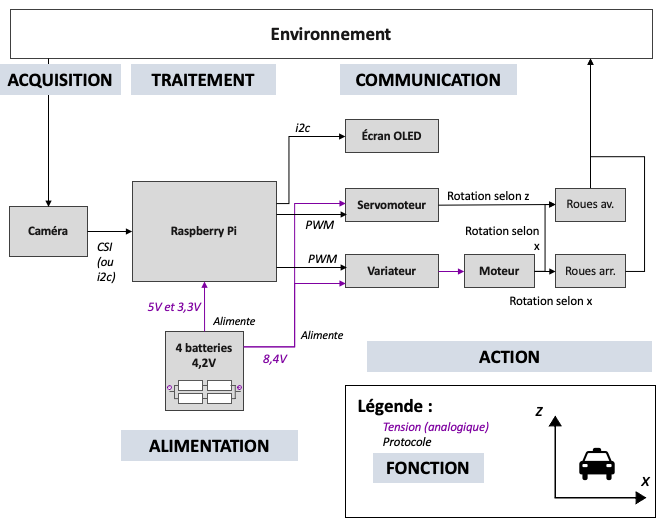
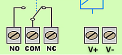
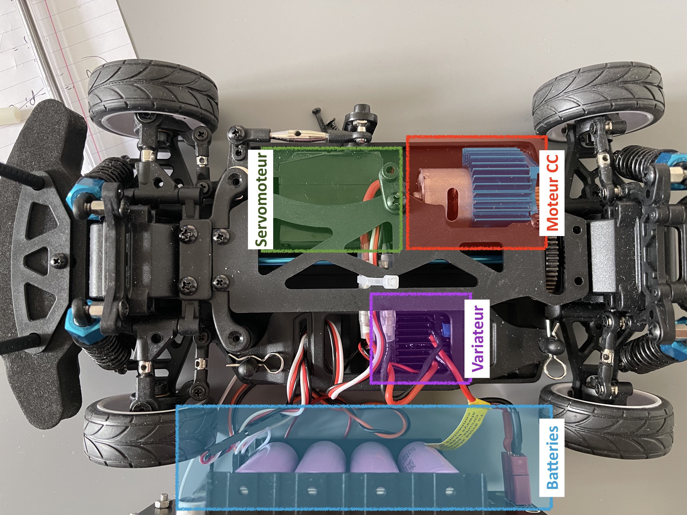

# Montage de la voiture

## Modèle de la voiture

Le modèle de voiture pour la voiture est le [PiRacer Pro de chez Waveshare](https://www.waveshare.com/piracer-pro-ai-kit.htm). Il existe un [wiki](https://www.waveshare.com/wiki/PiRacer_Pro_AI_Kit) sur le site de Waveshare pour le montage de la voiture. L'école possède 3 voitures de ce type. Toutefois, l'une des voitures est tombée en panne (servomoteur qui ne répond pas).

La voiture comprend :

- 1 chassis
- 4 roues
- 5 batteries 4,2V
- 1 servomoteur (6kg/cm torque) qui fait tourner les roues avant
- 1 variateur qui alimente un moteur
- 1 moteur (RC380) qui fait tourner les 4 roues
- 1 caméra
- 1 petit écran OLED
- 1 Raspberry Pi 4 B+ (commandée séparément)

Il faut y rajouter un coupe-circuit pour être en conformité avec les règles de sécurité requise pour la participation à la course.

## Schéma technique



## Montage
Le montage de la voiture se fait de manière relativement simple. Il y a cependant un certains points d’attention :

- Bien vérifier la position des interrupteurs du servomoteur avant le montage de la carte.
- Connecter la carte électronique, les moteurs et l’alimentation en se référant à la documentation de la voiture.
- Faire attention à bien recharger les batteries. Si les batteries ne sont pas assez chargées, le servomoteur peut ne pas fonctionner.

## Installation du coupe-circuit

Le coupe-circuit est une demande de Sigma, c’est donc un ajout réglementaire pour participer à la compétition. Concrètement, il s’agit d’un commutateur qui est contrôlable à distance par une zapette.

<center>



Schéma d'un commutateur

</center>

### Matériel nécessaire 

- Le coupe circuit
- Un amplificateur de puissance ou une pile 23a ou 27a avec support
- Des jumpers (1 à 3 M-M, 3 M-F)
- Quelque chose pour fixer l’ensemble (nous avons utilisé un élastique)

### Branchements essentiels 

1. Identifier le fil par lequel les données transitent jusqu’au moteur (en passant par le variateur) - c’est le fil blanc.
2. Prolonger le fil de données relié au moteur (avec un M-M) et le brancher en CO du commutateur.
3. Prolonger le pin de données en sortie de la carte noire (avec un M-F) et le brancher sur la borne NC.
4. À l’aide d’une pile 23a (12V) et d’un porte-pile, alimenter les bornes V+ et V- du commutateur en conséquence.

<center>



Identification des fonctions de la voiture

</center>

### Points de vigilance 

- Lorsque le coupe circuit est éteint, il met en contact les bornes CO et NC, donc il faut bien brancher le fil vers le moteur sur la branche NC si l’on veut pouvoir utiliser la voiture sans alimentation du commutateur (ex : le temps d’obtenir une pile ou le porte-pile).
- Même si la diode de l’interrupteur s’allume avec l’alimentation de la voiture, cela ne suffit pas à l’ouvrir et le fermer, il faut donc bien du 12V en entrée (pour cela il faut soit une pile soit un amplificateur de puissance)

## Ajout d'un controlleur - manette

Il est possible de connecter plusieurs types de manette de jeu à la voiture. Une [section de la documentation](https://docs.donkeycar.com/parts/controllers/) est dédiée à ce sujet. Lors de ce projet, nous  avons connecté une manette de PS4 à la voiture. Pour utiliser la manette, il faudra rajouter l'argument ```--js``` à la commande pour lancer la voiture ([voir exécution de la voiture](https://github.com/Rom-1T/ia_racing_imt/tree/main/integration/mycar)).

##### Avantages à connecter sa propre manette :
- Meilleur contrôle sur les joysticks (notamment pour la vitesse)
- Meilleures sensations (confort)

##### Inconvénients à connecter sa propre manette :
- La manette se connecte en bluetooth (contrairement à celle fournie qui fonctionne en bluetooth avec un plug USB)
- Le processus de connexion de la manette peut être un peu fastidieux si la manette a été connectée à un autre appareil entre 2 connexions à la voiture. Dans ce cas, il faut supprimer l’appairage et recommencer un nouvel appairage.

##### Tips 
- Penser à bien noter l’adresse MAC de la manette à sa première connexion (évitera de re scanner pour les connexions ultérieures)

### Connecter une manette

Il n'y a rien à ajouter à la [documentation](https://docs.donkeycar.com/parts/controllers/) qui détaille très bien cette section.

### Supprimer une manette
Lorsqu'une manette a été connectée sur un autre périphérique après avoir été connecté à la voiture, il est laborieux de la reconnecter. Le plus simple est de supprimer l'appairage de la manette et de la reconnecter.

1. Se connecter à la voiture en ssh
2. Dans le terminal, taper ```bluetoothctl```.
3. *(Facultatif si on connaît déjà l'adresse MAC de la manette)* Pour voir les appareils connectés antérieurement, taper ```paired-devices```.
4. Pour déconnecter la manette, taper ```remove aa:bb:cc:dd:ee:ff``` où ```aa:bb:cc:dd:ee:ff``` est l’adresse MAC de la manette.

Il est alors possible de refaire la connexion à la manette.


## Voir ensuite

- [Installer l'OS de la Raspberry](https://github.com/Rom-1T/ia_racing_imt/tree/main/integration)

