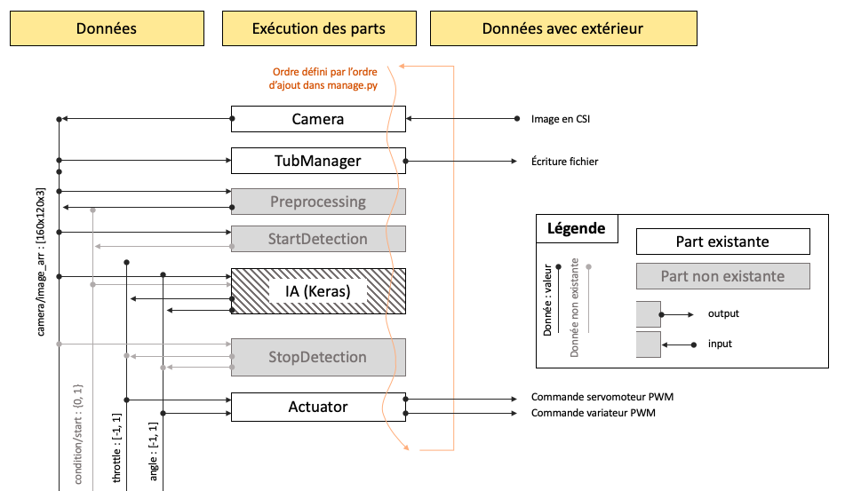

# Donkeycar application

L'application donkeycar qu'on appelle par abus de langage la voiture est l'ensemble des fichiers et données propres aux exécutions d'une configuration de la voiture. En d'autres termes, le framework est la colonne vertébrale, et les voitures/applications donkeycar font appel au framework pour exécuter les parts. Créer une voiture permet de définir la configuration de l’application et les parts à exécuter. Ainsi, avoir plusieurs voitures peut permettre de tester plusieurs configurations. 


> Dans cet exemple, la voiture 1, 2 et 3 peuvent avoir des paramètres différents et appeler des parts différentes.


## Structure de la voiture

La voiture est structurée en plusieurs répertoires et fichiers.


### Répertoire ```data```

Le répertoire ```data``` stocke les images récupérées lors de la conduite. Il stocke également les fichiers contenant les valeurs d'angle et de vitesse de la voiture pour chaque image. Les données sont stockées dans des tubs. Pour entraîner le modèle en conduite supervisée, il faudra récupérer les données enregistrées dans les tubs.


### Répertoire ```models```

Le répertoire a vocation à contenir les différents modèles entraînés.

### Le fichier ```myconfig.py```
Ce fichier regroupe toutes les constantes de configuration de la voiture. En effet, les parts ont été développées pour être le plus réglable possible grâce à de nombreuses variables/constantes. L’ensemble de tous les réglages de toutes les parts est modifiable dans ce fichier. De fait, en changeant le fichier de configuration myconfig.py, on peut avoir des voitures qui appellent une même part avec des paramètres différents.

Voici quelques réglages conseillés en amont du projet :

- Avoir l'image dans le bon sens

    ```python
    CAMERA_VFLIP = True
    CAMERA_HFLIP = True
    ```

- Enregistrer chaque exécution de la voiture dans un nouveau tub (utile pour récupérer les données d'une seule conduite)

    ```
    AUTO_CREATE_NEW_TUB = True
    ```

Pour revenir aux réglages de base, il suffit de recommenter la ligne (ajouter un # au début) car les constantes de ```myconfig.py``` viennent écraser celles de ```config.py``` (celles par défaut).

### Le fichier ```manage.py````

Le fichier ```manage.py``` contient la méthode *drive* qui est exécutée lorsqu'on lance la voiture. Elle permet d’ajouter les parts qu’on souhaite utiliser lors de l'exécution de la voiture. La méthode appelle les méthodes *add* et *start* de ```vehicle.py``` du framework donkeycar qui permettent d’ajouter des parts et de les exécuter dans l’ordre d’ajout. Dans la méthode *drive* on définit aussi les données d’entrée et de sortie des parts. Les entrées des unes peuvent être les sorties des autres. 

Par exemple, pour ajouter le preprocessing des images, on peut ajouter la part *Preprocessing* qu’on a créé et ajoutée dans le répertoire ```parts``` de donkeycar. Dans le bloc de code suivant, on vérifie la constante binaire ```PREPROCESSING``` dans ```myconfig.py``` (l’ensemble des constantes est accessible dans la variable ```cfg```). Cela permet de désactiver la part rapidement si besoin. Ensuite, on importe la part et on l’initialise avec les constantes de ```myconfig.py```. Finalement, on ajoute la part en lui renseignant les inputs souhaités (ici, l’image de la caméra) et les outputs qu’elle renvoie à chaque exécution (ici, l’image rognée et l’image préprocessée).

```python
if cfg.PREPROCESSING:
    from donkeycar.parts.preprocessing import Preprocessing
    prepro = Preprocessing(cfg)
    V.add(prepro, inputs=['cam/image_array'], outputs=['prepro/image_cropped', 'prepro/image_lines'])
```

On peut créer des “canaux” d’entrée ou de sortie en fonction des besoins. Par exemple, avant l’exécution de cette part, les canaux *prepro/image_cropped* et *prepro/images_lines* n’existent pas.

Une fois que toutes les parts ont été ajoutées, elles sont jouées en boucle dans l’ordre d’ajout.

```python
V.start(rate_hz=cfg.DRIVE_LOOP_HZ, max_loop_count=cfg.MAX_LOOP)
```




## Vue d'ensemble de la voiture (software + hardware)

L'image suivante permet d'illustrer les différents composants de la voiture, aussi bien matériels que logiciels. Elle représente les données qui transitent ainsi que les protocoles utilisés pour cela.


