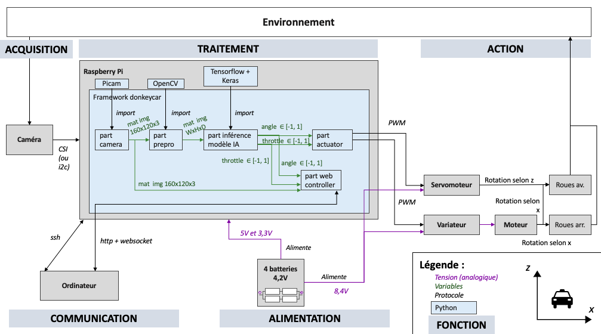

# Donkeycar application

L'application donkeycar qu'on appelle par abus de langage la voiture est l'ensemble des fichiers et données propres aux exécutions d'une configuration de la voiture. En d'autres termes, le framework est la colonne vertébrale, et les voitures/applications donkeycar font appel au framework pour exécuter les parts. Créer une voiture permet de définir la configuration de l’application et les parts à exécuter. Ainsi, avoir plusieurs voitures peut permettre de tester plusieurs configurations. 


> Dans cet exemple, la voiture 1, 2 et 3 peuvent avoir des paramètres différents et appeler des parts différentes.


## Structure de la voiture

La voiture est structurée en plusieurs répertoires et fichiers.


### Répertoire ```data```

Le répertoire ```data``` stocke les images récupérées lors de la conduite. Il stocke également les fichiers contenant les valeurs d'angle et de vitesse de la voiture pour chaque image. Les données sont stockées dans des tubs. Pour entraîner le modèle en conduite supervisée, il faudra récupérer les données enregistrées dans les tubs.

Dans le répertoire ```data``` de ce repository, nous avons laissé un tub (certes inintéressant au niveau des images) pour en comprendre la structure.

#### Les images
Les images du tubs sont stockées dans le répertoire images. Elles sont numérotées et suffixées par *"_cam_image_array_"*.

#### Les catalogs
Les données angulaires et de vitesse sont enregistrées dans des catalogs (par défaut de 1000 entrées) nommés ```catalog_X.catalog```.
Chaque ligne d'un catalog est un dictionnaire convertit en json qui enregistre les données liées à l'enregistrement d'une image.

Par exemple, lors de la prise de l'image ```32_cam_image_array_.jpg``` le 23 mars 2023, on peut voir que l'angle était à 0 mais la vitesse était à -0.5571428571428572 (les vitesses comme les angles sont normés entre -1 et 1) en conduite manuelle. Cela signifie que la voiture était en train de reculer.

```json
{"_index": 32, "_session_id": "23-03-23_0", "_timestamp_ms": 1679574357691, "cam/image_array": "32_cam_image_array_.jpg", "user/angle": 0.0, "user/mode": "user", "user/throttle": -0.5571428571428572}
```

Le fichier ```catalog_X.catalog_manifest``` indique la date de création du catalog X, la longueur de chacune des lignes du catalog X (nombre de caractère + 1 qui correspond retour à la ligne (\n)) ainsi que son chemin et le premier indice de l'image enregistrée pour ce catalog.

```json
{"created_at": 1679574289.9697988, "line_lengths": [182, 182, "…", 185, 185, 185], "path": "catalog_0.catalog_manifest", "start_index": 0}
```

> __Warning__ : si on veut nettoyer les données pour faire un entraînement en supervisé, il faut s'assurer que les catalogs soient bien cohérents avec les images. Par exemple, si on supprime une image, il faut supprimer les données associées. Si on supprime une ligne du catalog, il faut supprimer la longueur de cette ligne dans le catalog_manifest. Pour cette raison, il vaut mieux avoir des catalogs de plus petite taille (par exemple 50 images) et supprimer les 50 images, le catalog et le catalog_manifest correspondants à celui où il y a eu une erreur de conduite. Dans ce cas, il faudra aussi modifier le manifest global.

#### Le manifest

Le manifest global contient plusieurs informations. Il indique les clefs des dictionnaires de chaque ligne des catalogs ainsi que les formats de données associés. Ensuite il indique la date de la course. Enfin il fait la liste de tous les catalogs associés à l'enregistrement du tub et indique le nombre maximum de lignes qu'ils ont ainsi que l'indice de la dernière ligne de données.

```json
["cam/image_array", "user/angle", "user/throttle", "user/mode"]
["image_array", "float", "float", "str"]
{}
{"created_at": 1679574289.967773, "sessions": {"all_full_ids": ["23-03-23_0"], "last_id": 0, "last_full_id": "23-03-23_0"}}
{"paths": ["catalog_0.catalog", "catalog_1.catalog"], "current_index": 79, "max_len": 50, "deleted_indexes": []}
```

> __Note__ : pour changer le nombre d'entrée par catalog, il suffit de rajouter le paramètre *max_catalog_len* lors de l'initialisation de *TubWriter* dans ```manage.py```. Une constante à rajouter dans ```myconfig.py``` peut être un choix judicieux pour changer facilement cette valeur.

### Répertoire ```models```

Le répertoire a vocation à contenir les différents modèles entraînés.

### Le fichier ```myconfig.py```
Ce fichier regroupe toutes les constantes de configuration de la voiture. En effet, les parts ont été développées pour être le plus réglable possible grâce à de nombreuses variables/constantes. L’ensemble de tous les réglages de toutes les parts est modifiable dans ce fichier. De fait, en changeant le fichier de configuration myconfig.py, on peut avoir des voitures qui appellent une même part avec des paramètres différents.

Voici quelques réglages conseillés en amont du projet :

- Avoir l'image dans le bon sens

    ```python
    CAMERA_VFLIP = True
    CAMERA_HFLIP = True
    ```

- Enregistrer chaque exécution de la voiture dans un nouveau tub (utile pour récupérer les données d'une seule conduite)

    ```
    AUTO_CREATE_NEW_TUB = True
    ```

Pour revenir aux réglages de base, il suffit de recommenter la ligne (ajouter un # au début) car les constantes de ```myconfig.py``` viennent écraser celles de ```config.py``` (celles par défaut).

### Le fichier ```manage.py```

Le fichier ```manage.py``` contient la méthode *drive* qui est exécutée lorsqu'on lance la voiture. Elle permet d’ajouter les parts qu’on souhaite utiliser lors de l'exécution de la voiture. La méthode appelle les méthodes *add* et *start* de ```vehicle.py``` du framework donkeycar qui permettent d’ajouter des parts et de les exécuter dans l’ordre d’ajout. Dans la méthode *drive* on définit aussi les données d’entrée et de sortie des parts. Les entrées des unes peuvent être les sorties des autres. 

Par exemple, pour ajouter le preprocessing des images, on peut ajouter la part *Preprocessing* qu’on a créé et ajoutée dans le répertoire ```parts``` de donkeycar. Dans le bloc de code suivant, on vérifie la constante binaire ```PREPROCESSING``` dans ```myconfig.py``` (l’ensemble des constantes est accessible dans la variable ```cfg```). Cela permet de désactiver la part rapidement si besoin. Ensuite, on importe la part et on l’initialise avec les constantes de ```myconfig.py```. Finalement, on ajoute la part en lui renseignant les inputs souhaités (ici, l’image de la caméra) et les outputs qu’elle renvoie à chaque exécution (ici, l’image rognée et l’image préprocessée).

```python
if cfg.PREPROCESSING:
    from donkeycar.parts.preprocessing import Preprocessing
    prepro = Preprocessing(cfg)
    V.add(prepro, inputs=['cam/image_array'], outputs=['prepro/image_cropped', 'prepro/image_lines'])
```

On peut créer des “canaux” d’entrée ou de sortie en fonction des besoins. Par exemple, avant l’exécution de cette part, les canaux *prepro/image_cropped* et *prepro/images_lines* n’existent pas.

Une fois que toutes les parts ont été ajoutées, elles sont jouées en boucle dans l’ordre d’ajout.

```python
V.start(rate_hz=cfg.DRIVE_LOOP_HZ, max_loop_count=cfg.MAX_LOOP)
```


## Vue d'ensemble de la voiture (software + hardware)

L'image suivante permet d'illustrer les différents composants de la voiture, aussi bien matériels que logiciels. Elle représente les données qui transitent ainsi que les protocoles utilisés pour cela.


