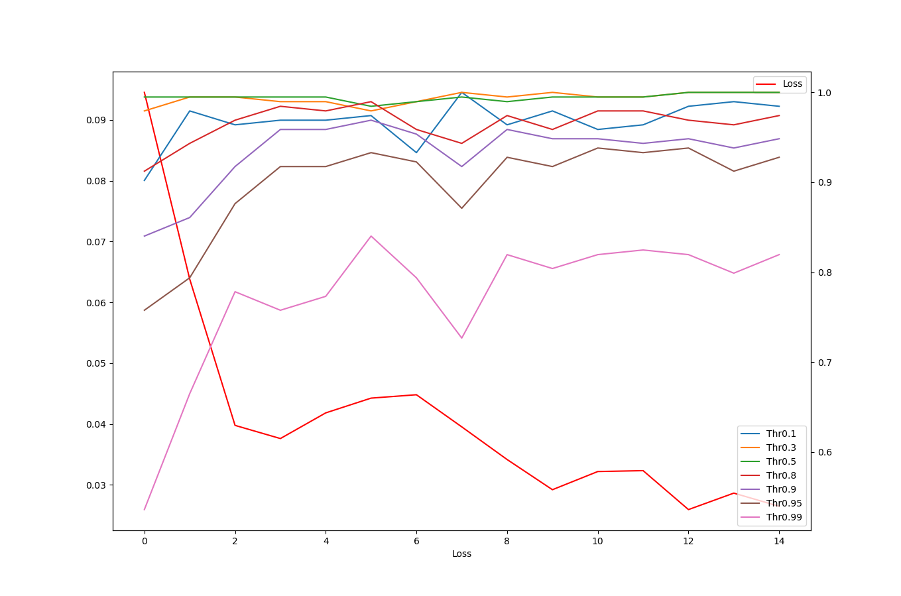

# Lot Stop

## Principe
Le principe de ce lot est d'être capable de détecter la ligne de stop lors d'une course. Chaque franchissement de la ligne de stop pourra être considéré comme l'achèvement d'un tour. De fait, si l'on sait détecter la ligne de stop, on sait compter le nombre de tours effectué par la voiture. Le présent lot se concentre uniquement sur la détection de la ligne de stop.

2 méthodes ont été apportées :

1. En utilisant un réseau de neurones pour détecter la ligne de stop.
2. En utilisant un masque de couleur pour identifier les zones jaunes en bas de l'image acquise par la caméra car la ligne de stop est jaune.

## Création des datasets

Quelque soit la méthode utilisée, il a fallu constituer un dataset d'images de lignes. La collecte d'images n'est pas le plus compliqué en soi, ni le plus long.
En revanche, labelliser les images était plus fastidieux. Pour cette raison, cette section détaille les scripts que nous avons utilisés.

L'ensemble des fichiers pour faciliter la labellisation des images se trouve dans le répertoire ```script_labeling```.

> __Warning__ : pour équilibrer l'apprentissage, il faut que les datasets soient équilibrés, c'est-à-dire qu'il y ait dans chaque dataset autant d'images sans ligne que d'images avec ligne de stop.

## Stop par Intelligence Artificielle

### Formalisation
La formalisation du problème d'optimisation est explicitée dans le document ```Formalisation.pdf```.

### ```stop-ia.py```

#### Prérequis
Installation de PyTorch.

#### Données d'entrée
Les données d'entrée sont à renseigner à travers la définition de constantes :

- ```ROOT_DIR``` : Fichier racine du projet
- ```MODELE_ENREGISTRE``` : Indique s'il faut charger un modèle déjà existant
- ```ENREGISTRER_MODELE``` : Indique s'il faut enregistrer le modèle
- ```MODELE_NAME``` : Indique le nom du modèle à charger et/ou enregistrer
- ```N_EPOCHS``` : Indique le nombre d'epochs à parcourir
- ```BATCH_SIZE_TRAIN``` : Indique la taille des lots pour l'entrainement
- ```BATCH_SIZE_VALIDATE``` : Indique la taille des lots pour la validation

- ```THRESHOLD``` : Indique le seuil de confiance que l'on souhaite pour considérer la présence d'une ligne

#### Données de sortie

En fonction des choix faits, les données de sortie peuvent être :
- le fichier du modèle
- les statistiques (de perte en fonction du seuil de confiance)

#### Résultats

Les résultats sont très bons. On peut arriver à des résultats fiables même en fixant un seuil de confiance assez haut. Par conséquent, cela signifie qu'on considère qu'il y a une ligne que si la probabilité qu'il y en ait une soit élevée. On constate qu'en faisant cela, la détection ne présente aucune faux positif (sur les jeux de données fournis) mais rate certaines détections. Ces erreurs vont dans le bon sens car on préfère rater la détection d'une ligne plutôt que de conclure à la présence d'une ligne alors qu'il n'y en avait pas. En effet, on préfère ne pas s'arrêter à la fin et risquer une pénalité plutôt que de s'arrêter en plein milieu de la course.



> __Warning__ : Erratum, ce n'est pas « Loss » sur l'axe des abscisses mais « Epochs ».

#### Fonctionnement

Le script est constitué de 3 classes :

##### La classe StopLineDataset
La classe StopLineDataset sert à créer les datasets au bon format pour pouvoir être utilisé par PyTorch. Elle permettra par la suite de pouvoir créer un DataLoader.

##### La classe Classif
C'est la classe maîtresse du fichier. Elle permet de :

- charger le modèle (méthode ```load_model```)
- charger les datasets (méthode ```set_dataset```)
- entraîner le modèle (méthode ```train```)
- vérifier les performances du modèle (validation avec la méthode ```validate```)
- afficher les statistiques (loss en fonction du nombre d'epochs avec les méthodes ```show_stats``` et ```test_several_thresholds```)

##### La classe Decision
C'est la classe qui permet d'implémenter le critère de décision sur la présence ou non de la ligne. En l'état, elle sert simplement de comparaison de la probabilité d'avoir une ligne renvoyée par le modèle à une seuil (threshold) défini.

##### Le main

Dans le main, on initie le modèle.

```python
if not(MODELE_ENREGISTRE):
    m = models.resnet18(pretrained=True)
    m.fc = nn.Sequential(
        nn.Linear(m.fc.in_features, 1),
        nn.Sigmoid()
    )
else:
    m = ROOT_DIR + MODELE_NAME

c = Classif()
c.load_model(m)
```

On indique ensuite la fonction de coût et l'optimiser.

```python
c.set_criterion(nn.BCELoss())
c.set_optimizer(optim.SGD(c.model.parameters(), lr=0.001, momentum=0.9))
c.scheduler = lr_scheduler.StepLR(c.optimizer, step_size=7, gamma=0.1)
```

On ajoute des datasets en leur définissant des noms.

```python
c.set_dataset('TRAIN', ROOT_DIR + 'dataset_sigma_crop/train', data_batch_size=BATCH_SIZE_TRAIN)
c.set_dataset('TEST', ROOT_DIR + 'dataset_sigma_crop/test', data_batch_size=BATCH_SIZE_TRAIN)

c.set_dataset('VALIDATION', ROOT_DIR + 'validation_dataset_sigma_crop', data_batch_size=BATCH_SIZE_VALIDATE)
```

On lance un entraînement sur les datasets portant les noms TRAIN (avec retropropagation) et TEST (sans retropropagation).

```python
c.train('TRAIN', 'TEST', N_EPOCHS)
```

On affiche les statistiques pour plusieurs seuils de confiance.

```python
c.test_several_thresholds([0.1, 0.3, 0.5, 0.8, 0.9, 0.95, 0.99])
```

On enregistre le modèle

```python
c.save(ROOT_DIR + MODELE_NAME)
```

On vérifie les performances sur un dataset indépendant (ici appelé VALIDATION)

```python
r, n, s, e = c.validate('VALIDATION')

print("Nombre d'images : ", n['total'])
print()
print("Détection de l'absence de ligne :")
print("   Erreurs :", n['errors']['should_be_0'])
print("   Réussites :", n['successes']['is_0'])
print()
print("Détection de la présence de ligne :")
print("   Erreurs :", n['errors']['should_be_1'])
print("   Réussites :", n['successes']['is_1'])

print(e) # Nombre d'erreurs au total
```

## Stop par plage de couleur (déterministe)

### Formalisation
Pour la détection de la ligne de stop de manière déterministe, on utilise la représentation de couleur HSV.


Grâce à cette représentation, on peut définir des bornes hautes et basses de couleur et rechercher les plages de couleurs comprises entre ces bornes.

> __Warning__ : en raison des conditions d'éclairage, les couleurs hautes et basses sont susceptibles d'évoluer d'une course à une autre. Il faut donc également établir un protocole de calibrage.

### ```stop-hsv.py```

Le fichier ```stop-hsv.py``` cherche à vérifier sur un dataset si la ligne de stop est bien détectée pour des valeurs de jaune haute et basse.

#### Prérequis
Installation de OpenCV.

> __Warning__ : OpenCV ouvre les images en BGR et non RGB par défaut. Dans le cas de la voiture, les images acquises seront en RGB.

#### Données d'entrée
Les données d'entrée sont à renseigner à travers la définition de constantes :

- ```IMG_DIR_SANS``` : Répertoire contenant des images à tester sans ligne de stop
- ```IMG_DIR_AVEC``` : Répertoire contenant des images à tester avec ligne de stop
- ```IMWRITE_DIR``` : Répertoire où enregistrer les détections (doit contenir un sous-répertoire *class_0* et un sous-répertoire *class_1* lui-même ayant un sous-répertoire *ignore*)

#### Données de sortie

Les données de sortie sont un aperçu des zones détectées comme étant des lignes de stop dans le dossier défini par ```IMWRITE_DIR```. Dans le sous-répertoire *class_0* sont enregistrées les images où une ligne a été détectée alors qu'il n'y en avait pas. Dans le sous-répertoire *class_1/ignore* sont enregistrées les images où aucune ligne n'a été détectée alors qu'il y en avait une. Dans *class_1* se trouve les détections a priori correctes (il reste à vérifier que la zone détectée est bien la bonne). 

Le script retourne aussi le nombre d'images où une potentielle ligne a été détectée sur le nombre d'images testées.

#### Résultats
Les résultats globaux sont plus mitigés que pour le modèle par classification mais très satisfaisant si l'étalonnage est réalisé juste avant la course.

En effet, sur les jeux de données fournis (images prises sur plusieurs journées), au mieux on constate une détection d'une ligne sur trois lorsqu'il y a présence de ligne. Avec un réglage exigeant et empirique, on peut arriver à avoir aucun faux positif. Ces résultats mitigés peuvent résulter des conditions de luminosité variante dans les conditions où les images ont été prises (pièce très lumineuse avec beaucoup de fenêtre). 

Si on réalise un étalonnage avant la course (donc dans les conditions de luminosité correspondant à celle de la course), on peut régler finement la détection de la ligne. Alors, le taux de faux positifs s'avère nul et le taux de détection n'est pas parfait non plus. Toutefois, à l'approche de la ligne (sur 2 à 4 images), la ligne est parfaitement détectée. Par conséquent la détection de la ligne par méthode déterministe est suffisamment satisfaisante pour pouvoir être implémentée sur le véhicule.

#### Fonctionnement

On définit les bornes hautes et basses du jaune. Le fichier ```settings/find_hsv_bounds.py``` peut grandement aider.

```python
lower = np.array([30, 53, 74])
upper = np.array([36, 255, 255])
```

On ouvre l'image qu'on convertit en HSV.

```python
video = cv2.imread(os.path.join(IMG_DIR_SANS, image.name))

video = video[40:np.shape(video)[0], :, :]
img = cv2.cvtColor(video, cv2.COLOR_BGR2HSV) # Converting BGR image to HSV format
```

On applique un masque à l'image.

```python
img=cv2.blur(img, (5,5))  # Blur

mask = cv2.inRange(img, lower, upper) # Masking the image to find our color

mask = cv2.erode(mask, None, iterations=4)
mask = cv2.dilate(mask, None, iterations=4)
image2 = cv2.bitwise_and(video, video, mask=mask)

mask_contours, hierarchy = cv2.findContours(mask, cv2.RETR_EXTERNAL, cv2.CHAIN_APPROX_SIMPLE) # Finding contours in mask image
```

On représente les zones de détection sur l'image d'origine.

```python
x, y, w, h = cv2.boundingRect(mask_contour)
cv2.rectangle(video, (x, y), (x + w, y + h), (0, 0, 255), 3)
```

On enregistre l'image avec la zone détectée.

```python
cv2.imwrite(IMWRITE_DIR + "class_0/" + image.name, cv2.cvtColor(video, cv2.COLOR_BGR2RGB))
```