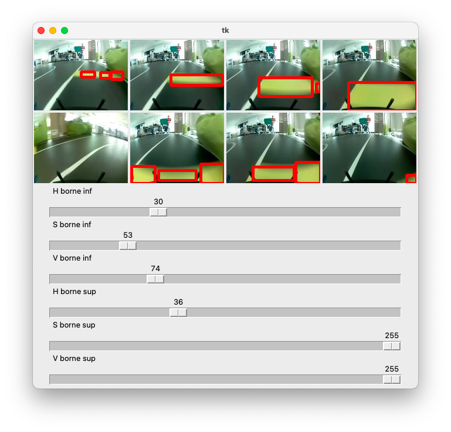

# Réglages

## ```find_hsv_bounds.py```

Le fichier ```find_hsv_bounds.py``` permet de trouver les valeurs extrêmes d'une plage de couleur en vue de déterminer la ligne de stop sur plusieurs images.

Son utilisation est simple et intuitive grâce à une interface graphique.



### Prérequis

Installation de OpenCV et de Tkinter.

### Données d'entrée
Dans la variable, ```imgs```, il suffit de lister les images sur lesquelles on veut tester la détection de couleur.

### Données de sortie
Les données de sortie sont le rendu visuel et la valeur de chaque curseur qui indiquent la valeur des bornes basse et haute de la plage de couleur à rechercher.

### Fonctionnement

On crée une fenêtre Tkinter.

```python
win = tk.Tk()
win.geometry("700x750")
```

On ajoute les images qu'on veut utiliser comme base de recherche.

```python
imgs = [
        cv2.imread(os.path.join(os.getcwd(), "../cars/imtaracing.local-mycar/data/tub_215_23-03-16/images/133_cam_image_array_.jpg")),
        cv2.imread(os.path.join(os.getcwd(), "../cars/imtaracing.local-mycar/data/tub_215_23-03-16/images/134_cam_image_array_.jpg")),
        cv2.imread(os.path.join(os.getcwd(), "../cars/imtaracing.local-mycar/data/tub_215_23-03-16/images/135_cam_image_array_.jpg")),
        cv2.imread(os.path.join(os.getcwd(), "../cars/imtaracing.local-mycar/data/tub_215_23-03-16/images/136_cam_image_array_.jpg")),
        cv2.imread(os.path.join(os.getcwd(), "../cars/imtaracing.local-mycar/data/tub_215_23-03-16/images/236_cam_image_array_.jpg")),
        cv2.imread(os.path.join(os.getcwd(), "../cars/imtaracing.local-mycar/data/tub_215_23-03-16/images/456_cam_image_array_.jpg")),
        cv2.imread(os.path.join(os.getcwd(), "../cars/imtaracing.local-mycar/data/tub_215_23-03-16/images/137_cam_image_array_.jpg")),
        cv2.imread(os.path.join(os.getcwd(), "../cars/imtaracing.local-mycar/data/tub_215_23-03-16/images/138_cam_image_array_.jpg"))
    ]
```
On affiche les images (en RGB) sur une grille de 4 colonnes.

```python
for i in range(len(imgs)):
    imgs[i] = cv2.cvtColor(imgs[i], cv2.COLOR_BGR2RGB)

    im[i] = Image.fromarray(imgs[i])
    imgtk[i] = ImageTk.PhotoImage(image=im[i])

    r, c = divmod(i, 4)
    imgLabel[i] = tk.Label(win, image= imgtk[i])
    imgLabel[i].grid(row = r, column = c)
```

On crée les sliders pour chaque valeur du HSV haut et du HSV bas (ici pour le H bas).

```python
lower_H = tk.Scale(win, from_=0, to=100, orient=tk.HORIZONTAL, command=show_values, length=600, label="H borne inf")
lower_H.grid(row = divmod(len(imgs), 4)[0] + 1, columnspan=4)
```

On affiche la fenêtre.

```python
win.mainloop()
```

On copie les images et on les convertit en HSV.

```python
imgs_hsv[i] = cv2.cvtColor(imgs[i], cv2.COLOR_RGB2HSV)
```

À chaque variation des curseurs, on appelle la fonction ```show_values``` et on trace les zones détectées sur les images.

On crée un nouveau masque avec les nouvelles valeurs qu'on applique aux images.

```python
mask = cv2.inRange(imgs_hsv[i], lower, upper)
mask = cv2.erode(mask, None, iterations=4)
mask = cv2.dilate(mask, None, iterations=4)
image2 = cv2.bitwise_and(imgs_hsv[i], imgs_hsv[i], mask=mask)

mask_contours, hierarchy = cv2.findContours(mask, cv2.RETR_EXTERNAL, cv2.CHAIN_APPROX_SIMPLE) # Finding contours in mask image
```

On dessine les zones détectées.

```python
x, y, w, h = cv2.boundingRect(mask_contour)
cv2.rectangle(img_copy, (x, y), (x + w, y + h), (255, 0, 0), 3)
```

On affiche le nouveau résultat en mettant à jour les images affichées sur l'interface.

```python
im = Image.fromarray(img_copy)
imgtk[i] = ImageTk.PhotoImage(image=im)
imgLabel[i].configure(image=imgtk[i])
imgLabel[i].image = imgtk[i]
```


